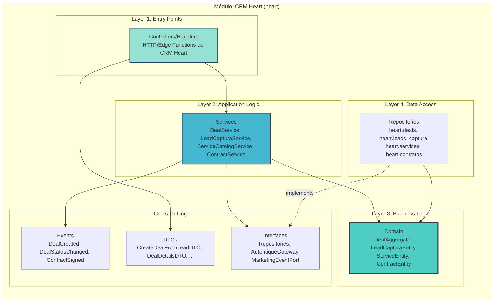
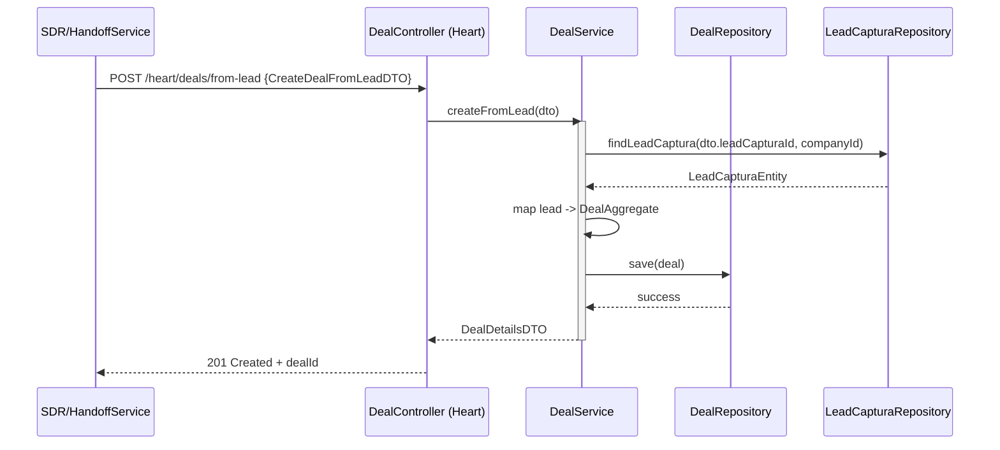
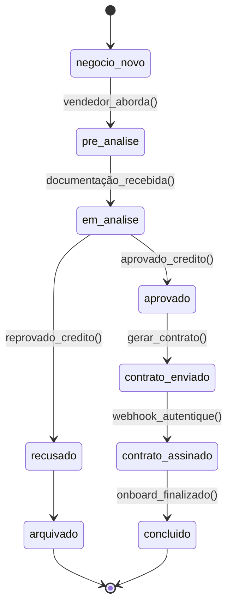

# Arquitetura Micro: CRM Operacional Heart (schema `heart`) v1.0

**Documento ID:** ARCH-heart-crm-v1
**Módulo:** CRM Operacional Heart
**Bounded Context:** Sales Pipeline & Operação Comercial por Empresa
**Data de Criação:** 2025-11-14
**Baseado em:** ARCH-MACRO-v2.0
**Status:** Draft

---

## Visão Geral do Módulo

**Responsabilidade Única (SRP):**
Gerenciar o **pipeline de vendas, contratos e operação comercial diária** para empresas que usam o CRM Heart, consumindo leads qualificados do SDR.

**Contexto:**

- Heart é um **schema de CRM** específico (`heart`), um entre vários possíveis (`law_crm`, `saas_crm`, etc.).
- Sempre opera com `company_id`; cada empresa tem seu conjunto de deals, serviços, contratos e equipe.
- Integra com:
  - `core` (governança, leads, contratos globais).
  - Módulo de Marketing & Tracking (eventos de conversão/remarketing).

---

## Arquitetura Interna de Camadas

### Entidades Principais

- **DealAggregate** (`heart.deals`)
- **LeadCapturaEntity** (`heart.leads_captura`)
- **ServiceEntity** (`heart.services`)
- **ContractEntity** (`heart.contratos` / integração com `core.contracts`)

### Fluxo: Criar Deal a partir de Lead Qualificado

---

## CRM Heart – Detalhamento por Camada

### Layer 1: Controllers

**Controllers típicos do CRM Heart:**

- `DealController`
  - `GET /heart/deals` → lista pipeline (filtros por status, vendedor, período).
  - `GET /heart/deals/:id` → detalhes de negócio.
  - `POST /heart/deals/from-lead` → criação a partir de lead/handoff.
  - `PATCH /heart/deals/:id/status` → mudança de etapa (`deal_status`).
- `LeadCapturaController`
  - `GET /heart/leads-captura` → listagem.
  - `POST /heart/leads-captura` → criação manual ou via landing.
- `ServiceCatalogController`
  - `GET /heart/services` / `POST /heart/services` / `PATCH /heart/services/:id`.
- `ContractController`
  - `POST /heart/deals/:id/contracts` → gerar contrato.
  - `GET /heart/deals/:id/contracts` → listar histórico de contratos.

Todos exigem JWT com:

- `company_id` → limita dados ao tenant.
- Claim de role (`sales_rep`, `manager`, `crm_admin`) → controla operações.

### Layer 2: Services

**`DealService`**

- `createFromLead(dto: CreateDealFromLeadDTO): Promise<DealDetailsDTO>`
  - Recebe identificadores de lead (no core/Heart) + `company_id`.
  - Copia dados de contato, scoring, UTM para `DealAggregate`.
  - Opcionalmente vincula a `ServiceEntity` com base em regras (ex.: tipo de negócio).
- `updateStatus(dealId, companyId, newStatus)`
  - Aplica regras de mudança de etapa (máquina de estados).
  - Dispara `DealStatusChangedEvent`.
- `attachFile(dealId, type, storagePath)`
  - Atualiza campos de documentos (RG, CNH, comprovante, áudio).

**`LeadCapturaService`**

- `createOrUpdateLeadCaptura(dto)`
  - Modela leads pré-deal (por exemplo, vindos de site ou de consultoria).
  - Usado tanto por Heart quanto por pipelines externos de captura.

**`ServiceCatalogService`**

- Garante que cada `ServiceEntity`:
  - Tenha valor padrão consistente (`valor_padrao`).
  - Estabeleça relação com `contrato_template_id` (no Heart ou core).

**`ContractService`**

- Orquestra geração/gestão de contratos:
  - Usa `IAutentiqueGateway` para criar documentos de assinatura.
  - Atualiza `ContractEntity` com `status`, `document_id_autentique`, URLs.
  - Dispara `ContractGeneratedEvent` e `ContractSignedEvent` (quando receber webhook).

### Layer 3: Domain – Regras do Deal

**Estados de `deal_status` em Heart (exemplo):**

**Invariantes de `DealAggregate`:**

- Não é permitido mudar `deal_status` de `arquivado` ou `concluido` para estados anteriores.
- Após `contrato_assinado`, campos críticos (valor, nº de parcelas) não podem ser alterados sem seguir um fluxo explícito de retificação (fora de escopo inicial).

### Layer 4: Data Model (schema heart)

**`heart.deals` (detalhado):**

- `id uuid PK`
- `company_id uuid NOT NULL`
- `deal_first_name text`, `deal_last_name text`, `deal_full_name text`
- `deal_phone text`, `deal_email text`
- `deal_cpf text`, `deal_rg text`
- Endereço (`deal_rua`, `deal_numero`, `deal_bairro`, `deal_cidade`, `deal_estado`, `deal_cep`)
- Serviço e valor:
  - `deal_servico text`
  - `service_id uuid NULL fk → heart.services.id`
  - `deal_valor_contrato numeric`
  - `deal_forma_pagamento text`
  - `deal_parcelas int`
  - `parcelas_datas jsonb`
- Documentos:
  - `deal_documento_frente text`
  - `deal_documento_verso text`
  - `deal_audio text`
  - `deal_copia_contrato_assinado text`
  - `deal_comprovante_residencia text`
- Workflow:
  - `deal_status text`
  - `motivo_rejeicao text`
  - `vendedor_responsavel uuid`
  - `data_primeira_parcela date`
  - `data_nascimento date`
- Tracking:
  - `pixel_config_id uuid NULL`
  - `contact_fingerprint text`
  - UTM fields (`utm_campaign`, `utm_source`, etc.)
- Auditoria:
  - `created_at`, `updated_at`

**`heart.services`**, `heart.leads_captura`, `heart.contratos`, `heart.equipe` seguem padrão semelhante, sempre com `company_id` e FK entre si conforme descrito na macro.

### Integração com Módulos

- Recebe handoff do SDR (via `HandoffService` do core) para criar deals.
- Envia eventos de:
  - `DealStatusChangedEvent` → usado pelo módulo de Marketing & Tracking.
  - `ContractSignedEvent` → usado tanto por Marketing quanto por relatórios globais.

---
