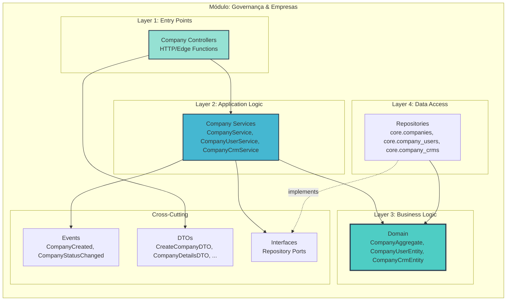
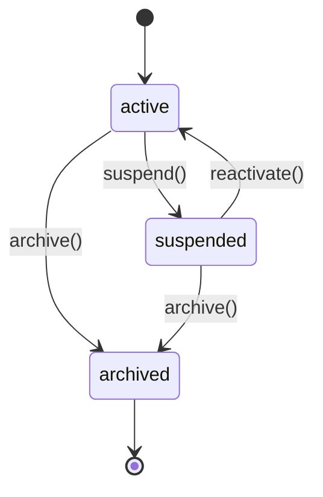

# Arquitetura Micro: Governança & Empresas (core.companies) v1.0

**Documento ID:** ARCH-core-companies-v1
**Módulo:** Governança & Empresas
**Bounded Context:** Company Management & Tenant Governance
**Data de Criação:** 2025-11-14
**Baseado em:** ARCH-MACRO-v2.0
**Status:** Draft

---

## Visão Geral do Módulo

### Propósito e Responsabilidade

**Responsabilidade Única (SRP):**
Gerenciar o ciclo de vida das **empresas da holding (tenants)** e seus vínculos com usuários e CRMs, garantindo governança e isolamento multi-tenant em todo o sistema.

**Bounded Context:**

Este módulo é o coração da governança multi-tenant. Ele define o que é uma **empresa** no sistema, quais usuários pertencem a cada empresa, quais CRMs (schemas) estão ativos para cada uma, e quais ativos operacionais (Centurions, instâncias WhatsApp, pixels, etc.) pertencem a qual empresa. Toda decisão de roteamento de leads, escopo de acesso e visibilidade de dados começa aqui.

**Por que este módulo existe:**

- Garantir que **tudo** (leads, instâncias, CRMs, pixels, contratos) esteja sempre vinculado a uma empresa (`company_id`).
- Permitir que o dono da holding administre, a partir de um **back-office único**, múltiplas empresas e seus CRMs.
- Ser a **fonte de verdade** para isolamento de dados e políticas de acesso (RLS, JWT claims, roles).

---

### Localização na Arquitetura Macro

**Referência:** ARCH-MACRO-v2.0 → Módulo "Governança & Empresas (core)"

```mermaid
graph TB
    subgraph "Sistema Completo"
        M1[SDR & Back-office (core.sdr)]
        M2[CRMs Operacionais (schemas)]
        TARGET[🎯 ESTE MÓDULO<br/>Governança & Empresas]
        M3[Marketing & Tracking]
    end

    TARGET -->|company_id, políticas| M1
    TARGET -->|company_id, binding schema| M2
    TARGET -->|company_id, configs| M3
    M1 -->|lead.company_id| TARGET
    M2 -->|crm_schema por empresa| TARGET

    style TARGET fill:#ff6b6b,stroke:#2c3e50,stroke-width:4px
```

---

### Capacidades Principais

| Operação              | Tipo    | Descrição                                                        | Input                   | Output                 |
|-----------------------|---------|------------------------------------------------------------------|-------------------------|------------------------|
| Criar empresa         | Command | Cria uma nova empresa/tenant e configura defaults               | `CreateCompanyDTO`      | `CompanyDetailsDTO`    |
| Gerenciar usuários    | Command | Adiciona/remove/atualiza usuários vinculados à empresa          | `UpsertCompanyUserDTO`  | `CompanyUserDTO`       |
| Configurar CRMs       | Command | Habilita/desabilita schemas CRM (ex: `heart`) para a empresa    | `ConfigureCompanyCrmDTO`| `CompanyCrmConfigDTO`  |
| Listar empresas       | Query   | Lista empresas e resumo de ativos/CRMs                          | `ListCompaniesFilterDTO`| `CompanyListItemDTO[]` |
| Resolver roteamento   | Query   | Dado `lead_id`, resolve empresa e CRM destino                   | `ResolveLeadRoutingDTO` | `LeadRoutingDecisionDTO`|

---

## Arquitetura Interna de Camadas



### Domain (conceito)

- **CompanyAggregate** – empresa da holding:
  - `id`, `name`, `slug`, `document`, `status`, `ownerUserId`, `settings`.
  - Regras de estado (`active`, `suspended`, `archived`).
- **CompanyUserEntity** – vínculo usuário ↔ empresa:
  - `companyId`, `userId`, `role`, `scopes`.
- **CompanyCrmEntity** – CRM/schema habilitado para empresa:
  - `companyId`, `schemaName`, `isPrimary`, `config`.

### Repositórios (interfaces)

```typescript
export interface ICompanyRepository {
  save(company: CompanyAggregate): Promise<void>;
  findById(id: CompanyId): Promise<CompanyAggregate | null>;
  findBySlug(slug: CompanySlug): Promise<CompanyAggregate | null>;
  existsBySlugOrDocument(slug: CompanySlug, document: CompanyDocument): Promise<boolean>;
  list(filter: ListCompaniesFilterDTO): Promise<CompanyAggregate[]>;
}
```

### Layer 1: Controllers (Entry Points)

**Principais controllers (back-office):**

- `CompanyController`
  - Rotas:
    - `POST /admin/companies` → criar empresa (`CreateCompanyDTO`)
    - `GET /admin/companies` → listar empresas (`ListCompaniesFilterDTO`)
    - `GET /admin/companies/:id` → detalhes (`CompanyDetailsDTO`)
    - `PATCH /admin/companies/:id` → atualizar nome/status/settings
- `CompanyUserController`
  - Rotas:
    - `POST /admin/companies/:id/users` → adicionar/atualizar usuário da empresa
    - `DELETE /admin/companies/:id/users/:userId` → remover usuário
    - `GET /admin/companies/:id/users` → listar equipe da empresa
- `CompanyCrmController`
  - Rotas:
    - `POST /admin/companies/:id/crms` → habilitar CRM/schema
    - `PATCH /admin/companies/:id/crms/:crmId` → alterar `is_primary`, config
    - `GET /admin/companies/:id/crms` → listar CRMs da empresa

**Regras de acesso:**

- Todos os endpoints exigem:
  - `auth.jwt()->>'role' = 'backoffice_admin'` (ou equivalente).
- Nenhum endpoint de CRM/SDR chamará estes controllers diretamente; eles são exclusivos do **back-office**.

### Layer 2: Services

**`CompanyService`**

- `createCompany(dto: CreateCompanyDTO): Promise<CompanyDetailsDTO>`
  - Normaliza `slug` a partir de `name`.
  - Garante unicidade (`existsBySlugOrDocument`).
  - Cria `CompanyAggregate` com estado inicial `active`.
  - Persiste via `ICompanyRepository`.
  - Publica `CompanyCreatedEvent`.
- `updateCompany(id, dto): Promise<CompanyDetailsDTO>`
  - Permite mudar nome, status, settings.
  - Valida transições de status (ex.: `archived` é terminal).
- `listCompanies(filter): Promise<CompanyListItemDTO[]>`

**`CompanyUserService`**

- `upsertCompanyUser(dto: UpsertCompanyUserDTO)`
  - Garante que `user_id` exista em `auth.users` (via port ou função Supabase).
  - Cria/atualiza `CompanyUserEntity` para um `companyId`.
  - Regra: sempre deve existir pelo menos um `owner` por empresa (business rule).
- `removeCompanyUser(companyId, userId)`
  - Impede remoção do último `owner`.

**`CompanyCrmService`**

- `configureCompanyCrm(dto: ConfigureCompanyCrmDTO)`
  - Valida `schemaName` contra lista de schemas CRM suportados.
  - Garante no máximo um `is_primary = true` por `companyId`.
  - Salva `CompanyCrmEntity`.
- `resolveRoutingForLead(leadId: UUID): LeadRoutingDecisionDTO`
  - Consulta `core.leads` → `company_id`.
  - Consulta `core.company_crms` → `schema_name` primário.
  - Retorna `companyId`, `schemaName`, `targetResource` (ex.: `"deals"`).

### Layer 3: Domain – Invariantes e Estados

**Estados de `CompanyStatus`:**



**Invariantes importantes:**

- `slug` nunca muda após criação (ou muda de forma muito controlada).
- `document` (CNPJ/CPF) se presente deve ser único entre empresas.
- Uma empresa `archived`:
  - Não pode receber novos usuários (apenas leitura).
  - Não pode receber novos CRMs (apenas consulta).
- Para cada empresa:
  - Deve haver **no mínimo** um usuário com `role = 'owner'`.
  - Pode haver no máximo um `CompanyCrmEntity` com `is_primary = true`.

### Layer 4: Data Model (core.companies, core.company_users, core.company_crms)

**`core.companies` (conceitual):**

- `id uuid PK`
- `name text NOT NULL`
- `slug text UNIQUE NOT NULL`
- `document text NULL` (CNPJ/CPF)
- `status text NOT NULL DEFAULT 'active'`
- `owner_user_id uuid NULL` (FK → `auth.users.id`)
- `settings jsonb NOT NULL DEFAULT '{}'::jsonb`
- `created_at timestamptz NOT NULL DEFAULT now()`
- `updated_at timestamptz NOT NULL DEFAULT now()`

**`core.company_users`:**

- `id uuid PK`
- `company_id uuid NOT NULL FK → core.companies.id`
- `user_id uuid NOT NULL FK → auth.users.id`
- `role text NOT NULL` (`owner`, `admin`, `operator`, `viewer`, `sales_rep`, etc.)
- `scopes text[] NOT NULL DEFAULT '{}'::text[]`
- `created_at timestamptz NOT NULL DEFAULT now()`
- `updated_at timestamptz NOT NULL DEFAULT now()`

**`core.company_crms`:**

- `id uuid PK`
- `company_id uuid NOT NULL FK → core.companies.id`
- `schema_name text NOT NULL` (ex.: `'heart'`, `'law_crm'`)
- `is_primary boolean NOT NULL DEFAULT false`
- `config jsonb NOT NULL DEFAULT '{}'::jsonb`
- `created_at timestamptz NOT NULL DEFAULT now()`
- `updated_at timestamptz NOT NULL DEFAULT now()`

### RLS & Claims JWT

Para estas tabelas, normalmente:

- **Back-office** (role `backoffice_admin`) tem acesso total:

```sql
CREATE POLICY "companies_admin_all"
ON core.companies
FOR ALL
USING  (auth.jwt()->>'role' = 'backoffice_admin')
WITH CHECK (auth.jwt()->>'role' = 'backoffice_admin');
```

- Usuários de CRM **não** acessam diretamente `core.companies`/`core.company_users` em rotas normais; o acesso é via views/funções controladas pelo back-office.

JWT típico para usuários de CRM:

- `sub` → `auth.users.id`
- `company_id` → empresa à qual o usuário está logado no momento.
- `role` → `crm_user` / `sales_rep` / `manager` etc.


---
