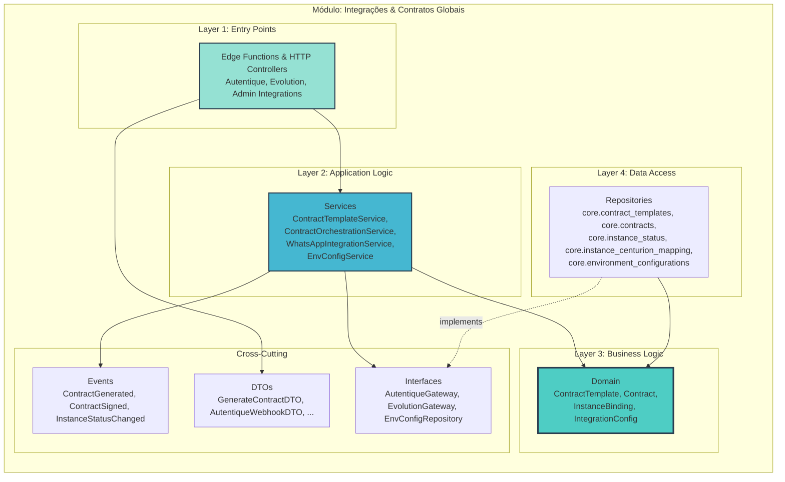
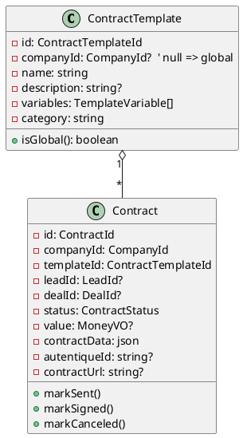
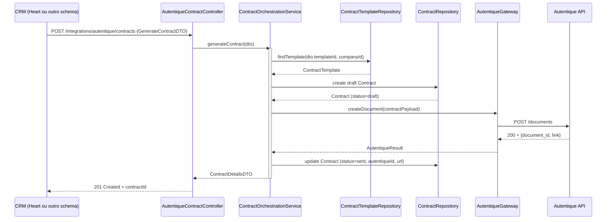
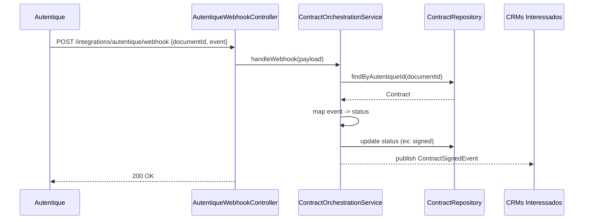
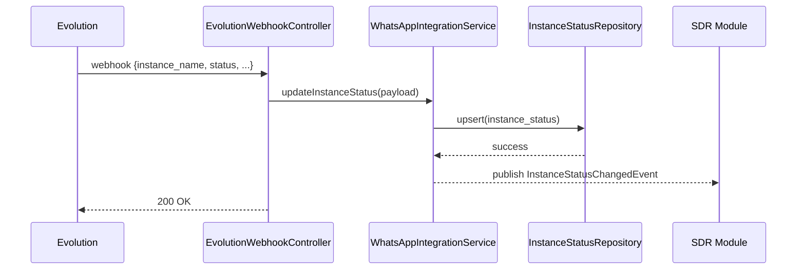

# Arquitetura Micro: Integrações & Contratos Globais v1.0

**Documento ID:** ARCH-integrations-v1
**Módulo:** Integrações & Contratos Globais
**Bounded Context:** Integration Hub & Contract Orchestration
**Data de Criação:** 2025-11-14
**Baseado em:** ARCH-MACRO-v2.0
**Status:** Draft

---

## Visão Geral do Módulo

### Propósito e Responsabilidade

**Responsabilidade Única (SRP):**
Ser o **hub central de integrações externas** (Autentique, WhatsApp provider/Evolution, APIs externas auxiliares) e a camada de **contratos globais** (templates e instâncias) que podem ser utilizados por qualquer CRM schema.

**Bounded Context:**

Este módulo governa:

- **Templates de contrato globais** (`core.contract_templates`) e instâncias (`core.contracts`).
- Integrações com **Autentique**:
  - Criação de documentos para assinatura.
  - Tratamento de webhooks de assinatura.
- Integrações com **WhatsApp provider (Evolution)**:
  - Webhooks de status e mensagens de instância.
  - Ações de controle (conectar/desconectar instâncias, ler QR code, etc.).
- **Configurações de ambiente e segredos** (`core.environment_configurations`) usados por todas as integrações.

Ele não decide "qual CRM" usar nem "como" a venda é conduzida; ele expõe serviços reutilizáveis para que SDR/CRMs plugados consigam:

- Gerar contratos padronizados.
- Enviar e acompanhar assinaturas.
- Operar instâncias de WhatsApp de forma multi-empresa.

---

### Localização na Arquitetura Macro

```mermaid
graph TB
    subgraph "Sistema Completo"
        CORE[Core / SDR & Back-office]
        GOV[Governança & Empresas]
        CRMS[CRMs (heart, schema_x, ...)]
        MKT[Marketing & Tracking]
        TARGET[🎯 ESTE MÓDULO<br/>Integrações & Contratos Globais]
        AUT[Autentique API]
        EVO[WhatsApp Provider (Evolution)]
        EXT[Outras APIs Externas]
    end

    GOV -->|company_id, settings| TARGET
    CORE -->|Lead/Deal info| TARGET
    CRMS -->|Solicita contrato / ações| TARGET
    MKT -->|Pode ler status de contrato| TARGET

    TARGET -->|HTTP/API| AUT
    TARGET -->|HTTP/Webhook| EVO
    TARGET -->|HTTP/API| EXT

    style TARGET fill:#ff6b6b,stroke:#2c3e50,stroke-width:4px
```

---

### Capacidades Principais

| Operação                          | Tipo    | Descrição                                                                                     | Input                    | Output                     |
|-----------------------------------|---------|-----------------------------------------------------------------------------------------------|--------------------------|----------------------------|
| Gerenciar templates de contrato   | Command | CRUD de `core.contract_templates` (globais ou por empresa)                                   | `UpsertContractTemplateDTO` | `ContractTemplateDetailsDTO` |
| Gerar contrato a partir de lead/deal | Command | Cria `core.contracts` e/ou contrato específico do CRM, aciona Autentique se necessário      | `GenerateContractDTO`    | `ContractDetailsDTO`       |
| Receber webhook de Autentique     | Command | Atualiza status de contratos com base em eventos de assinatura                               | `AutentiqueWebhookDTO`   | `WebhookAckDTO`            |
| Gerenciar instâncias WhatsApp     | Command | Ações em instâncias (status, reconexão, QR) integradas com Evolution                         | `InstanceActionDTO`      | `InstanceStatusDTO`        |
| Resolver/envia configs sensíveis  | Query   | Lê configs em `core.environment_configurations` (via views seguras) para Edge Functions      | `EnvConfigQueryDTO`      | `EnvConfigDTO`             |

---

## Arquitetura Interna de Camadas



---

## Layer 1: Controllers / Edge Functions

### Entry Points para Autentique

- **`AutentiqueContractController` (core)**
  - Expõe endpoints/Edge Functions:
    - `POST /integrations/autentique/contracts` → gerar contrato (utilizado por SDR/CRMs).
    - `POST /integrations/autentique/webhook` → receber eventos (documento criado, assinado, expirado).
  - Proteção:
    - Endpoints de geração: JWT com `company_id` e role apropriada (`crm_admin`, `closer`).
    - Webhook: secret de Autentique (header token/assinatura).

### Entry Points para Evolution (WhatsApp)

- **`EvolutionWebhookController`**
  - `POST /integrations/evolution/webhook`:
    - Recebe eventos de instância: conectado, desconectado, QR codeready, erro, etc.
    - Atualiza `core.instance_status`.
  - Encaminha mensagens para `SDR & Leads` (já detalhado no módulo SDR).

- **`EvolutionInstanceActionController`**
  - `POST /integrations/evolution/instances/:name/actions`:
    - Ações como `connect`, `disconnect`, `restart`, `get_qr`.
    - Usa `WhatsAppIntegrationService`.

### Entry Points de Admin de Integrações

- `IntegrationAdminController`
  - CRUD de configurações de integrações sensíveis armazenadas em `core.environment_configurations`:
    - Chaves de API de Autentique, Evolution, etc.
  - Usa `EnvConfigService` + views seguras para nunca expor valores em claro.

---

## Layer 2: Services (Application Logic)

### `ContractTemplateService`

Responsável por `core.contract_templates`:

- `createOrUpdateTemplate(dto: UpsertContractTemplateDTO)`
  - Permite templates:
    - Globais (`company_id IS NULL`).
    - Específicos da empresa (`company_id = tenant`).
  - Mantém metadados:
    - Nome, descrição, categoria.
    - Lista de variáveis (`variables jsonb`) e tipos.
- `listTemplates(companyId, filter)`
  - Aplica regra:
    - Templates globais + templates da empresa.
- Gera `ContractTemplateVariablesDTO` para CRMs preencherem campos (nome do cliente, CPF, valor, etc.).

### `ContractOrchestrationService`

Serve tanto para SDR quanto para CRMs:

- `generateContract(dto: GenerateContractDTO): Promise<ContractDetailsDTO>`
  - Passos:
    1. Resolve `company_id` e template (`core.contract_templates` ou template do CRM).
    2. Monta payload (`payload jsonb`) com variáveis substituídas (nome, CPF, valor, etc.).
    3. Cria registro em `core.contracts` **antes** de chamar Autentique (estado `draft`).
    4. Chama `AutentiqueGateway.createDocument(payload)`.
    5. Atualiza `core.contracts` com `autentique_id`, `contract_url`, `status = 'sent'`.
    6. Dispara `ContractGeneratedEvent`.

- `syncContractStatus(autentiqueId, newStatus, webhookPayload)`
  - Chamado pelo Webhook de Autentique.
  - Atualiza `core.contracts` (e, se aplicável, `heart.contratos` ou contrato do CRM).
  - Se `status = 'signed'`, dispara `ContractSignedEvent` com `companyId`, `leadId`/`dealId`.

### `WhatsAppIntegrationService`

- Mantém a visão do estado das instâncias em `core.instance_status`:
  - `state` (`connected`, `disconnected`, `qr_ready`, `error`).
  - `phone_number`, `profile_name`, `last_connected_at`.
- Fornece métodos para Edge Functions:
  - `updateInstanceStatusFromWebhook(payload)`
  - `requestInstanceAction(instanceName, action)`: delega a Evolution via `EvolutionGateway`.
- Em conjunto com `core.instance_centurion_mapping`, permite que o SDR identifique:
  - Qual Centurion responde por qual instância.
  - Qual `company_id` está associado àquela instância.

### `EnvConfigService`

- Responsável por acesso seguro a `core.environment_configurations`:
  - Encapsula criptografia via extensões (pgcrypto/pgsodium) e `vault`.
  - Disponibiliza apenas view `decrypted_environment_configurations` para roles internas (edge functions com `service_role`).
  - Aplica categorias:
    - `ai`, `agno`, `evolution`, `autentique`, `marketing`, etc.

---

## Layer 3: Domain (Business Logic)

### Entidades de Contrato



**Estados de `ContractStatus`:** `draft`, `sent`, `signed`, `canceled`, `expired`.

Regras:

- Não é permitido retornar de `signed` para `draft`.
- Cancelamentos podem exigir auditoria (motivo, usuário).

### Entidades de Integrações

**InstanceBinding / InstanceStatus** (já modeladas em core.sdr, aqui vistas como parte do domínio de integrações):

- `instance_name`
- `company_id`
- `centurion_id`
- `state`
- `metadata jsonb`

**IntegrationConfig** (modelada em `core.environment_configurations`):

- `key` (ex.: `AUTENTIQUE_API_TOKEN`, `EVOLUTION_API_URL`)
- `value` (criptografado para chaves sensíveis)
- `is_sensitive`
- `category`

---

## Layer 4: Data Access

### Tabelas de Contratos (schema core)

**`core.contract_templates`** (conceito refinado):

- `id uuid PK`
- `company_id uuid NULL` (NULL = template global, não dono de uma empresa específica)
- `name varchar NOT NULL`
- `description text NULL`
- `variables jsonb NOT NULL DEFAULT '[]'::jsonb`
  (lista de objetos `{ key, label, type, required }`)
- `category varchar NOT NULL DEFAULT 'general'`
- `active boolean NOT NULL DEFAULT true`
- `usage_count int NOT NULL DEFAULT 0`
- `created_at`, `updated_at`

**`core.contracts`**:

- `id uuid PK`
- `company_id uuid NOT NULL`
- `lead_id uuid NULL` FK → `core.leads.id`
- `deal_id uuid NULL` (para casos em que o CRM informa o negócio ligado)
- `template_id uuid NOT NULL FK → core.contract_templates.id`
- `status varchar NOT NULL DEFAULT 'draft'`
- `contract_url text NULL`
- `autentique_id text NULL`
- `contract_data jsonb NOT NULL DEFAULT '{}'::jsonb`
  (dados mesclados no template: variáveis resolvidas)
- `value numeric NULL`
- `signed_at timestamptz NULL`
- `first_payment_at timestamptz NULL`
- `created_at`, `updated_at`

### Tabelas de Configuração e Instâncias

**`core.environment_configurations`** e views:

- Campos já descritos no macro; aqui importante:
  - `is_sensitive boolean`
  - `vault-backed` para valores que devem ser criptografados.
  - Views:
    - `decrypted_environment_configurations` (acessível apenas a roles internas).
    - `public_environment_configurations` (apenas configs não sensíveis).

**`core.instance_status`**, `core.instance_centurion_mapping`:

- Já descritas na macro e no módulo SDR; aqui são usadas como fonte de verdade de integrações com Evolution.

---

## Fluxos Principais

### 1. Geração de Contrato via Autentique



### 2. Webhook de Assinatura Autentique



### 3. Atualização de Instância Evolution



---

## Segurança & Multi-Tenancy

- Todas as entidades de contrato e instância são associadas a `company_id`.
- Secrets de integrações **nunca** saem de `core.environment_configurations`/`vault` em claro para front-ends.
- Edge Functions que usam tokens sensíveis operam com:
  - Role `service_role`.
  - Leitura apenas através da view `decrypted_environment_configurations`.
- Autentique/Evolution webhooks:
  - Validados por token secreto e, idealmente, IP allowlist (config externamente).

---

## Resumo

O módulo **Integrações & Contratos Globais**:

- Fornece uma camada única e reutilizável de **templates de contrato** e **instâncias**.
- Centraliza integrações com Autentique e Evolution, desacoplando SDR/CRMs de detalhes de APIs externas.
- Usa `core.environment_configurations` como fonte de configs/segredos para todas integrações.
- Serve como base para qualquer novo schema de CRM reutilizar contratos e infraestrutura externa de forma padronizada.

---
