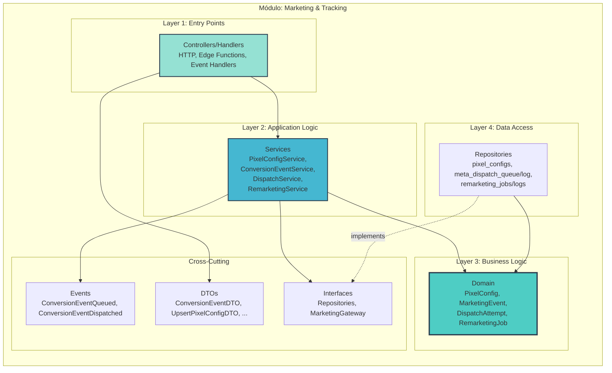
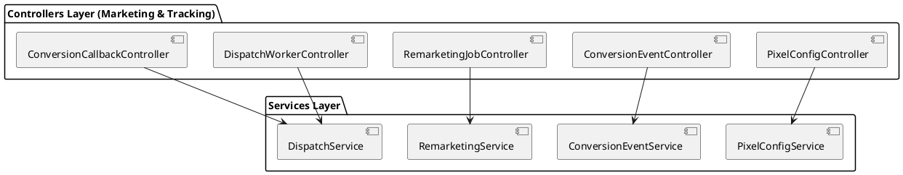
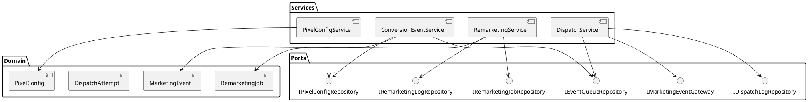
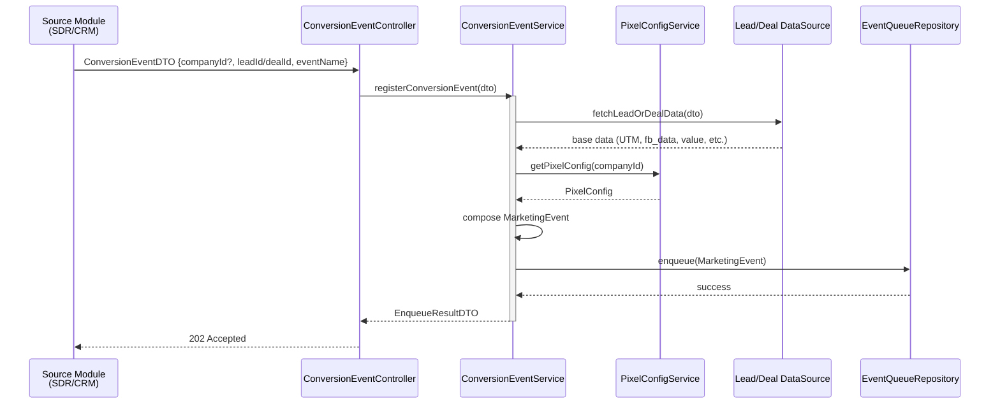
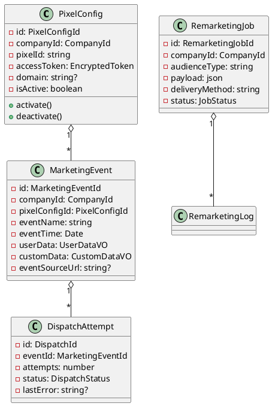
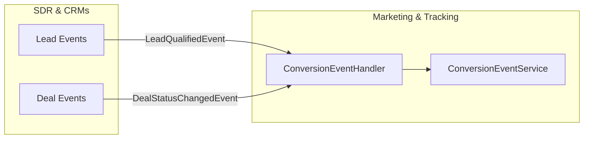
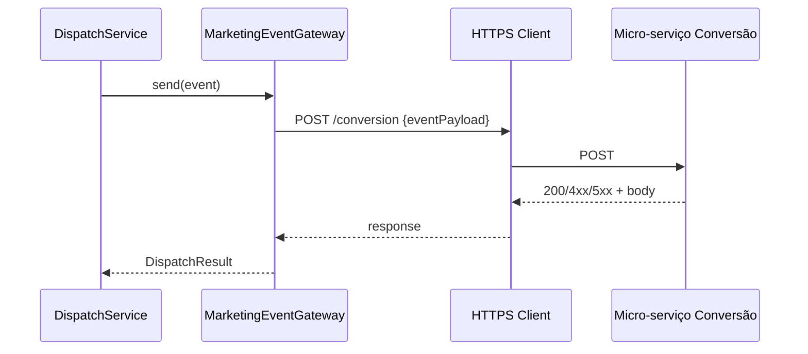

# Arquitetura Micro: Marketing & Tracking v1.0

**Documento ID:** ARCH-marketing-tracking-v1
**Módulo:** Marketing & Tracking (Pixels, Conversões, Remarketing)
**Bounded Context:** Marketing Attribution & Remarketing por Empresa
**Data de Criação:** 2025-11-14
**Baseado em:** ARCH-MACRO-v2.0
**Status:** Draft

---

## Visão Geral do Módulo

### Propósito e Responsabilidade

**Responsabilidade Única (SRP):**
Centralizar toda a lógica de **tracking de marketing, pixels, eventos de conversão e remarketing**, garantindo multi-tenancy por empresa, integração consistente com o core SDR/CRMs e com o micro-serviço de conversões (ex: Facebook CAPI).

**Bounded Context:**

Este módulo governa:

- **Configuração de pixels** e integrações de marketing por empresa.
- **Fila de eventos de conversão** disparados por ações de negócio (lead capturado, deal ganho, contrato assinado).
- **Logs de dispatch** e feedback do micro-serviço de conversão/marketing.
- **Jobs de remarketing** (criação/lista de audiência, disparos de campanhas).

Ele não "faz CRM" nem "faz SDR"; ele observa eventos de leads/deals e decide como transformá-los em eventos de marketing, sempre respeitando `company_id` e o CRM schema que originou o evento.

**Por que este módulo existe:**

- Remover lógica de tracking dispersa entre core, Heart e futuros CRMs.
- Ter um **ponto único** para falar com Marketing externo (Facebook CAPI/micro-serviço de conversão).
- Permitir que cada CRM schema projete seus dados, mas use o mesmo "contrato de conversão".

---

### Localização na Arquitetura Macro

**Referência:** ARCH-MACRO-v2.0 → Módulo "Marketing & Tracking"

```mermaid
graph TB
    subgraph "Sistema Completo"
        CORE[Core / SDR<br/>(core)]
        GOV[Governança<br/>(core.companies)]
        HEART[CRM Heart<br/>(heart)]
        CRMX[CRM Futuro<br/>(schema_x)]
        TARGET[🎯 ESTE MÓDULO<br/>Marketing & Tracking]
        MS[Micro-serviço Conversão/Marketing<br/>(externo)]
    end

    CORE -->|LeadQualified, LeadCreated| TARGET
    HEART -->|DealStatusChanged, ContractSigned| TARGET
    CRMX -->|Eventos equivalentes| TARGET
    GOV -->|company_id, configs| TARGET

    TARGET -->|Enqueue + Dispatch| MS
    MS -->|Webhook/Callback Opcional| TARGET

    style TARGET fill:#ff6b6b,stroke:#2c3e50,stroke-width:4px
```

---

### Capacidades Principais

| Operação                       | Tipo    | Descrição                                                                                   | Input                    | Output                  |
|--------------------------------|---------|---------------------------------------------------------------------------------------------|--------------------------|-------------------------|
| Configurar pixel por empresa   | Command | CRUD de configurações de pixel (ID, token, domain, etc.)                                   | `UpsertPixelConfigDTO`   | `PixelConfigDetailsDTO` |
| Registrar evento de conversão  | Command | Recebe evento de negócio (lead/deal) e o transforma em evento de marketing enfileirado     | `ConversionEventDTO`     | `EnqueueResultDTO`      |
| Executar dispatch de eventos   | Command | Worker: busca fila, chama micro-serviço de conversão, marca resultados e logs              | `DispatchBatchDTO`       | `DispatchBatchResultDTO`|
| Criar job de remarketing       | Command | Gera job (segmento, lista de leads/deals) para remarketing                                 | `CreateRemarketingJobDTO`| `RemarketingJobDetailsDTO`|
| Consultar status de eventos    | Query   | Fornece métricas e logs de dispatch/remarketing por empresa                                | `TrackingStatusFilterDTO`| `TrackingStatusDTO[]`   |

---

## Arquitetura Interna de Camadas

### Visão Geral das Camadas



---

## Layer 1: Controllers/Handlers (Entry Points)

### Fontes de Entrada

- **Eventos internos** (via serviços de SDR/CRMs):
  `LeadCreatedEvent`, `LeadQualifiedEvent`, `DealStatusChangedEvent`, `ContractSignedEvent`.
- **HTTP/Edge Functions**:
  - Administração de `pixel_configs` (back-office).
  - Criação de `remarketing_jobs`.
- **Workers agendados**:
  - `meta-queue-worker` para despachar eventos de conversão.
- **Callbacks do micro-serviço** (opcional):
  - Webhook de confirmação/falha adicional.

### Diagrama de Componentes (Entry Points)



### Estrutura de Arquivos (sugestão)

```text
modules/marketing/controllers/
 ├── pixel-config.controller.ts
 ├── conversion-event.controller.ts
 ├── remarketing-job.controller.ts
 ├── dispatch-worker.controller.ts
 └── conversion-callback.controller.ts
```

### Guidelines

- Endpoints administrativos:
  - Exigem JWT com `company_id` + role `backoffice_admin` ou `marketing_admin`.
- Handlers internos (chamados por SDR/CRMs ou via service role):
  - Não devem confiar em `company_id` vindo do payload; usam `leadId`/`dealId` para buscar `company_id` no core/CRM quando necessário.
- Worker (`dispatch-worker`):
  - Só usa `company_id` que está nos registros de fila (`meta_dispatch_queue`).

---

## Layer 2: Services (Application Logic)

### Services Principais

- **PixelConfigService**
  - CRUD de configurações de pixel por empresa.
  - Resolve, para cada `company_id`, qual pixel está ativo.

- **ConversionEventService**
  - Recebe `ConversionEventDTO` (lead/deal + contexto de campanha).
  - Enriquece com:
    - `company_id`
    - `pixel_config` ativo (via `PixelConfigService`)
    - dados de tracking (`fb_data`, UTM, etc.).
  - Normaliza em `MarketingEvent` e enfileira (`meta_dispatch_queue`).

- **DispatchService**
  - Processa fila de eventos:
    - Seleciona itens pendentes.
    - Envia para micro-serviço (`MarketingEventGateway`).
    - Registra resultado em `meta_dispatch_log`.

- **RemarketingService**
  - Cria `remarketing_jobs` (segmento de leads/deals).
  - Gera `remarketing_logs` para cada target.
  - Pode acionar micro-serviço para criar audiências externas.

### Diagrama de Componentes (Services + Ports)



### Fluxo: Registrar Evento de Conversão



---

## Layer 3: Domain (Business Logic)

### Entidades Principais

**PixelConfig**

- `id`, `companyId`
- `pixelId text`
- `metaAccessToken` (armazenado de forma segura)
- `metaTestEventCode text?`
- `domain text?`
- `isActive boolean`

Regras:

- Apenas pixels marcados como `isActive = true` devem ser usados para dispatch.
- Tokens nunca são expostos fora da camada de infra/gateway.

**MarketingEvent**

- `companyId`, `pixelConfigId`
- `eventName` (ex: `"Lead"`, `"Purchase"`, `"CompleteRegistration"`)
- `eventTime`
- `userData` (hashes e campos exigidos pela API de conversão)
- `customData` (valor, moeda, etc.)
- `eventSourceUrl`

**DispatchAttempt**

- `queueItemId`
- `attempts`
- `status` (`pending`, `processing`, `success`, `failed`)
- `lastError`, `responseStatus`, `responseBody`, `responseHeaders`.

**RemarketingJob**

- `companyId`
- `audienceType`
- `payload jsonb` (critérios, filtros)
- `deliveryMethod`
- `status`
- `scheduledAt`, `createdAt`, `updatedAt`.

### Diagrama de Classes



---

## Layer 4: Repository (Data Access)

### Tabelas Relacionadas (conceitual)

Dependendo da estratégia, estas tabelas podem ficar no schema de cada CRM (ex.: `heart`) ou em um schema compartilhado de marketing (`core_marketing`). A modelagem é a mesma; muda apenas o schema.

```text
pixel_configs
- id uuid PK
- company_id uuid FK -> core.companies.id
- pixel_id text NOT NULL
- meta_access_token text
- meta_test_event_code text NULL
- domain text NULL
- is_active boolean NOT NULL
- created_at timestamptz
- updated_at timestamptz

meta_dispatch_queue
- id bigserial PK
- company_id uuid
- pixel_config_id uuid
- event_name text
- request_payload jsonb
- status text ('pending','processing','failed','completed')
- attempts int
- last_attempt_at timestamptz
- last_error text
- created_at timestamptz
- updated_at timestamptz

meta_dispatch_log
- id bigserial PK
- company_id uuid
- pixel_config_id uuid
- event_name text
- status_code int
- success boolean
- request_payload jsonb
- response_body jsonb
- response_headers jsonb
- error_message text
- created_at timestamptz
```

### Interfaces de Repositório

```typescript
export interface IPixelConfigRepository {
  upsert(config: PixelConfig): Promise<void>;
  findActiveByCompany(companyId: CompanyId): Promise<PixelConfig | null>;
  listByCompany(companyId: CompanyId): Promise<PixelConfig[]>;
}

export interface IEventQueueRepository {
  enqueue(event: MarketingEvent): Promise<void>;
  fetchPending(limit: number): Promise<MarketingEvent[]>;
  markProcessing(eventId: MarketingEventId): Promise<void>;
  markResult(eventId: MarketingEventId, result: DispatchResult): Promise<void>;
}

export interface IDispatchLogRepository {
  log(result: DispatchResult): Promise<void>;
}
```

---

## Integração com Outros Módulos

### Eventos Consumidos

- `LeadCreatedEvent`, `LeadQualifiedEvent` (core.sdr)
- `DealCreatedEvent`, `DealStatusChangedEvent`, `ContractSignedEvent` (schemas de CRM)

Handlers convertem esses eventos em `ConversionEventDTO` e chamam `ConversionEventService`.



### Eventos Publicados

- `ConversionEventQueuedEvent`
- `ConversionEventDispatchedEvent`
- `ConversionEventFailedEvent`
- `RemarketingJobCreatedEvent`
- `RemarketingJobCompletedEvent`

Esses eventos podem alimentar dashboards/analytics internos.

### MarketingEventGateway



---

## Segurança & Multi-Tenancy

- Todas as tabelas deste módulo possuem `company_id`.
- RLS:
  - Usuários CRM só podem ver configs/logs da própria empresa (`company_id` do JWT).
  - Workers com `service_role` podem processar múltiplas empresas, mas o código deve sempre respeitar o escopo de cada registro.

---

## Resumo

O módulo **Marketing & Tracking**:

- Centraliza a inteligência de tracking e integração com o micro-serviço de conversão/ads.
- Fica pluggado em cima do `core` e de múltiplos schemas de CRM, sempre por `company_id`.
- Expõe contratos claros (DTOs, eventos, repositórios) para que qualquer CRM schema possa disparar eventos de marketing de forma padronizada.

---
