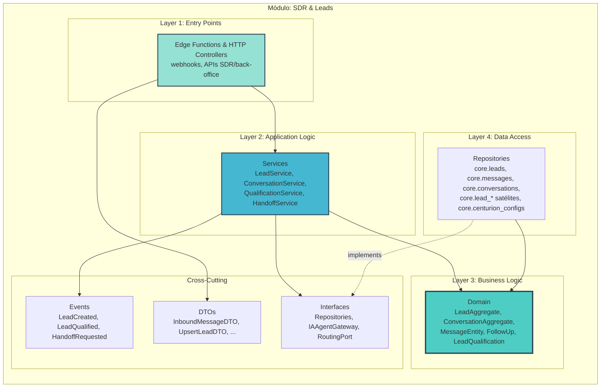
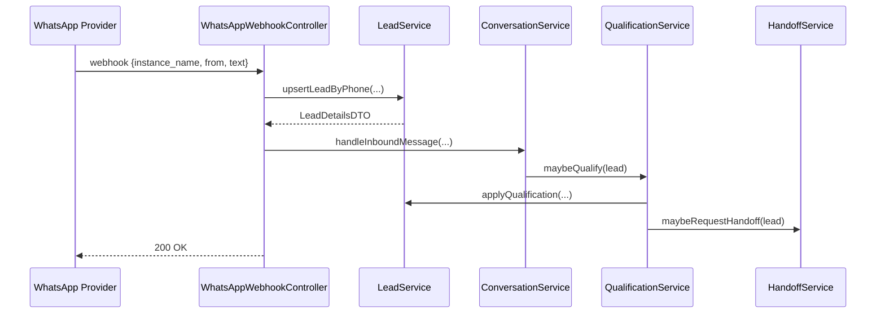
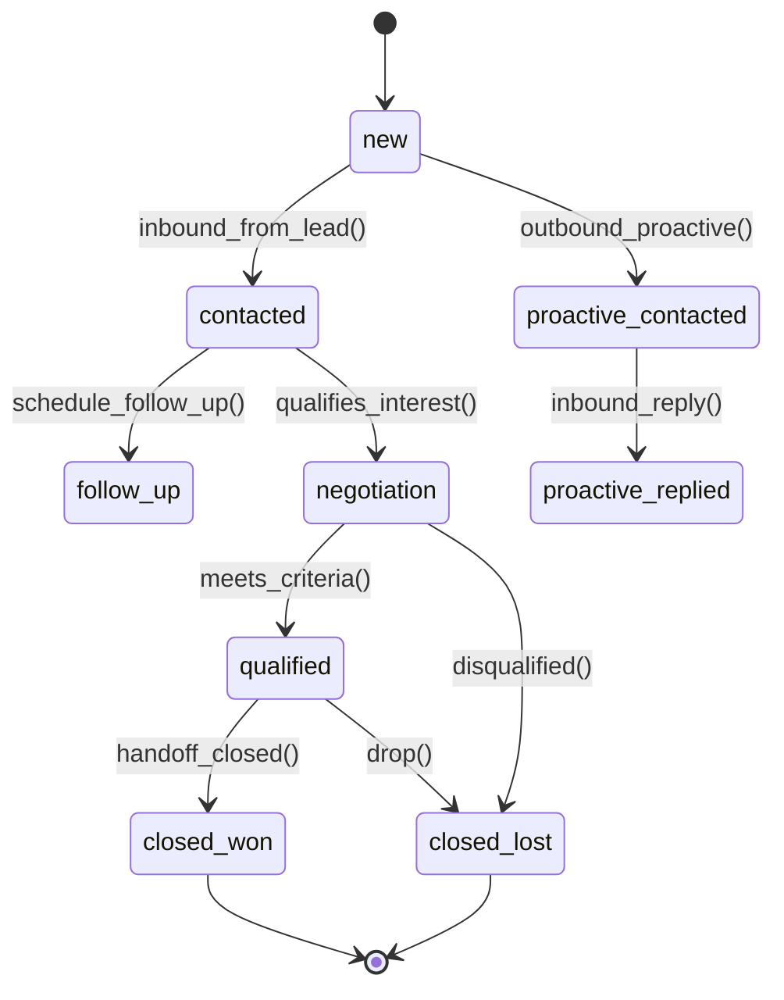

# Arquitetura Micro: SDR & Leads (core.sdr) v1.0

**Documento ID:** ARCH-core-sdr-v1
**Módulo:** SDR & Leads (core.sdr)
**Bounded Context:** SDR Multicanal & Orquestração de Conversas
**Data de Criação:** 2025-11-14
**Baseado em:** ARCH-MACRO-v2.0
**Status:** Draft

---

## Visão Geral do Módulo

**Responsabilidade Única (SRP):**
Orquestrar todo o ciclo de vida de leads e conversas automatizadas (WhatsApp + Centurions) em modo multi-empresa, até o handoff para o CRM específico de cada empresa.

**Bounded Context:**

Responsável por tudo entre o primeiro contato (WhatsApp, captura, input externo) e a qualificação/handoff do lead:

- Criação/atualização de leads canônicos (`core.leads`).
- Gestão de conversas (`core.conversations`, `core.messages`).
- Qualificação via Centurions (IA).
- Follow-ups, eventos de funil, métricas.
- Handoff para schemas de CRM (ex.: `heart`).

---

### Localização na Arquitetura Macro

```mermaid
graph TB
    subgraph "Sistema Completo"
        GOV[Governança & Empresas]
        TARGET[🎯 SDR & Leads (core.sdr)]
        CRMS[CRMs (schemas heart, x, y...)]
        MKT[Marketing & Tracking]
    end

    GOV -->|company_id, assets| TARGET
    TARGET -->|Lead Handoff| CRMS
    TARGET -->|Conversion Events| MKT

    style TARGET fill:#ff6b6b,stroke:#2c3e50,stroke-width:4px
```

---

## Arquitetura Interna de Camadas



### Entidades-chave

- **LeadAggregate** (`core.leads` + satélites `lead_events`, `lead_follow_ups`, etc.)
- **ConversationAggregate** (`core.conversations` + `core.messages`)
- **CenturionConfig** (`core.centurion_configs`)

### Fluxo Webhook WhatsApp (alto nível)



---

# SDR & Leads – Detalhamento por Camada

## Layer 1: Controllers / Entry Points

**Principais entry points:**

- `WhatsAppWebhookController` (Edge Function `agno-process-message`)
  - Recebe webhooks do provider (Evolution ou similar).
  - Extrai `instance_name`, `from` (telefone), `body` da mensagem, media, metadata.
  - Resolve `company_id` via:
    - `instance_name` → `core.instance_centurion_mapping` → `company_id`.
  - Chama `LeadService.upsertLeadByPhone` e `ConversationService.handleInboundMessage`.

- `ProactiveJobController` (Edge Function `proactive-bulk-trigger`)
  - Executado por cron/worker.
  - Lê `core.lead_proactive_assignments` e `core.centurion_configs` para selecionar leads elegíveis.
  - Enfileira mensagens proativas (via `ConversationService`).

- `LeadAdminController`
  - Rotas para UI do back-office / SDR:
    - `GET /sdr/leads` → listar leads por filtros (empresa, estágio, Centurion, tags).
    - `PATCH /sdr/leads/:id` → atualizar dados/estágio/qualificação manualmente.
    - `POST /sdr/leads/:id/follow-ups` → criar follow-up.

**Regras de acesso:**

- Endpoints públicos (webhook):
  - Protegidos por token/secret do provider (header/signature).
  - Não exigem JWT, mas sempre resolvem `company_id` via mapeamento interno.
- Endpoints autenticados:
  - JWT com `company_id` e roles (`sdr_operator`, `backoffice_admin` etc.).

## Layer 2: Services

**`LeadService`**

Responsável por:

- `upsertLeadByPhone({companyId, phone, name?, email?, source})`
  - Busca lead existente por `companyId + phone`.
  - Se não existir, cria `LeadAggregate` com `lifecycle_stage = 'new'`.
  - Atualiza campos opcionais (nome/email) se vierem mais completos.
- `updateLeadStage(leadId, companyId, newStage)`
  - Chama método de domínio `LeadAggregate.changeStage`.
  - Persiste e dispara `LeadStageChangedEvent`.
- `applyQualification(leadId, companyId, result)`
  - Atualiza `is_qualified`, `qualification_score`, `qualification_data`.
  - Pode mover lead automaticamente para `qualified`/`closed_lost`.
- `scheduleFollowUp(dto: ScheduleFollowUpDTO)`
  - Cria/atualiza `FollowUpEntity` (`core.lead_follow_ups`).

**`ConversationService`**

- `handleInboundMessage({companyId, instanceName, phone, text, media})`
  - Recupera/gera `LeadAggregate`.
  - `getOrCreateConversation(leadId, companyId, centurionId)` – baseado em mapeamento instância ↔ Centurion.
  - Cria `MessageEntity` inbound.
  - Atualiza `ConversationAggregate` (presença, `last_inbound_at`, `queue_depth`).
  - Envia evento para `QualificationService` decidir se deve acionar IA.

- `sendOutboundMessage({conversationId, content, centurionId})`
  - Cria `MessageEntity` outbound.
  - Atualiza estado da conversa (debounce, presença).
  - Dispara Edge Function de envio via provider WhatsApp (outro módulo de infra).

**`QualificationService`**

- Decide **quando** acionar IA:
  - Após certas palavras-chave, mudança de estágio, ou timeout.
- Usa `IIAAgentGateway`:
  - Constrói contexto a partir de:
    - Histórico de conversas (`core.messages` recentes).
    - Config do Centurion (`core.centurion_configs`).
    - Conhecimento adicional (base de conhecimento, `agent_knowledge_base` se for o caso).
  - Recebe resposta (textos, decisões, score).
  - Atualiza `LeadAggregate` (qualificação e estágio).
  - Pode gerar mensagens automáticas (via `ConversationService`).

**`HandoffService`**

- `requestHandoff(leadId, companyId)`
  - Verifica se critérios de handoff foram atingidos (regra de negócio).
  - Registra em `core.lead_handoffs` (`status = 'pending'`).
  - Chama `ICompanyRoutingPort` (Governança) para resolver CRM/schema.
  - Dispara evento/Edge Function para CRM de destino (`heart`, etc.).

## Layer 3: Domain – Estados & Entidades

### LeadAggregate – máquina de estados



### ConversationAggregate – regras principais

- Nunca responder se:
  - `debounce_until > now()`
  - `presence` indica que já há outra resposta em andamento.
- `queue_depth` ajuda a decidir se é seguro enviar mais mensagens (para evitar flood).

## Layer 4: Data Model (principais tabelas core.sdr)

**`core.leads`** – já descrita na macro; aqui reforçamos:

- Índices recomendados:
  - `idx_leads_company_phone (company_id, phone)`
  - `idx_leads_company_lifecycle (company_id, lifecycle_stage)`

**`core.conversations`** (conceitual):

- `id uuid PK`
- `company_id uuid`
- `lead_id uuid`
- `centurion_id text`
- `agent_state text`
- `lead_state text`
- `presence text`
- `debounce_until timestamptz`
- `last_inbound_at`, `last_outbound_at`
- `queue_depth int`
- `metadata jsonb`

**`core.messages`**:

- `id uuid PK`
- `company_id uuid`
- `lead_id uuid`
- `conversation_id uuid`
- `direction text` (`inbound`/`outbound`)
- `channel text` (`whatsapp`)
- `content text`
- `status text`
- `metadata jsonb` (WABA message ids, etc.)

**`core.lead_follow_ups`**, `core.lead_qualifications`, `core.lead_events` seguem o padrão satélite: sempre `company_id`, `lead_id`, dados específicos, `created_at`/`updated_at`.

## Integração com Governança & CRMs

- Usa `company_id` de:
  - Webhook (derivado de instância).
  - JWT (para APIs SDR internas).
- Para handoff:
  - Chama `Governança` para `resolveRoutingForLead(leadId)`.
  - Usa portas específicas para cada CRM (ex.: `HeartHandoffPort` para schema `heart`).

---
