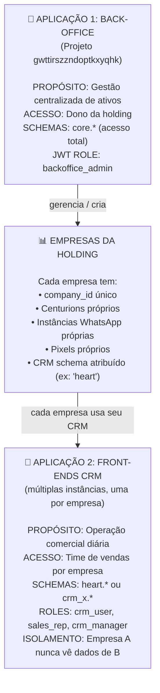
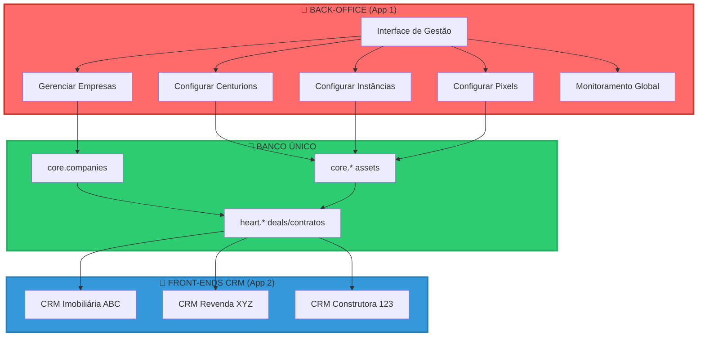
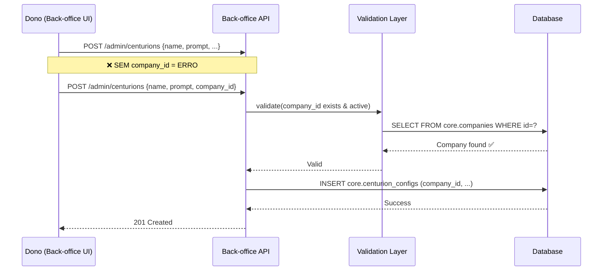
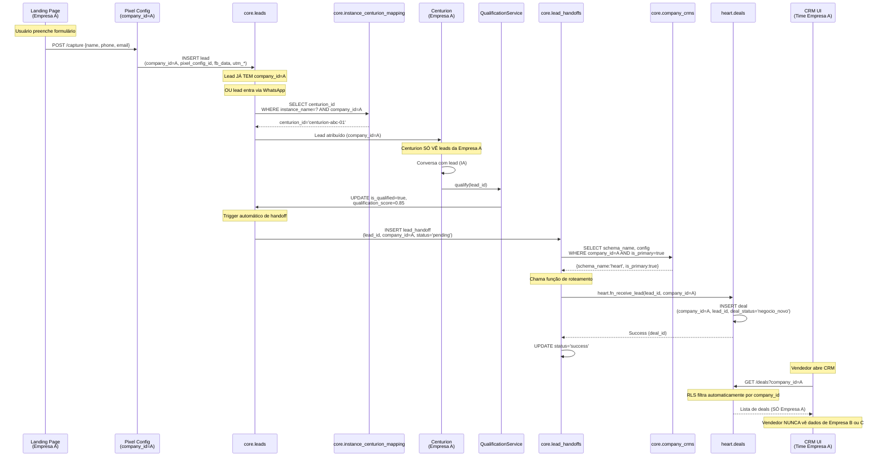

# Arquitetura Backend Consolidada: Centurion SDR & CRM Multi-Tenant v2.0

**Documento ID:** ARCH-BACKEND-v2  
**Data de Criação:** 2025-11-14  
**Baseado em:** ARCH-MACRO-v2.0 + módulos micro (Governança, SDR, CRM Heart, Marketing, Integrações, RLS)  
**Status:** Draft  

---

## 1. Visão Geral

Este documento consolida a visão **macro** e alguns pontos **micro** mais críticos da arquitetura do backend Centurion SDR & CRM Multi-Tenant, com foco em:

- Diferenciar claramente as **duas aplicações** principais (Back-office vs Front-ends CRM).
- Reforçar a **governança multi-tenant por empresa** (`company_id`).
- Descrever o fluxo **end-to-end** de um lead, do marketing até o CRM.
- Formalizar o modelo de **eventos de marketing** (`core.marketing_events`) que substitui o antigo Tracker.
- Exemplificar o **mapeamento de empresas para ativos operacionais** (Centurions, instâncias, pixels, deals).

---

## 2. Arquitetura de Aplicações – Back-office vs Front-ends

### 2.1 Visão Conceitual

Existem **duas aplicações completamente diferentes** operando sobre o mesmo banco Supabase:

1. **Aplicação 1: Back-office** – usada exclusivamente pelo dono da holding / operadores de nível global.
2. **Aplicação 2: Front-ends CRM** – UIs operacionais usadas por times de vendas, isoladas por empresa.



**Ponto-chave:** o **back-office não é apenas “um CRM com permissões maiores”** – é uma aplicação de governança separada, com UX, responsabilidades e perfis de acesso próprios. Ele cria e configura empresas, enquanto os CRMs são a “linha de frente” operacional dessas empresas.

### 2.2 Diagrama de Fluxo entre Aplicações e Banco



---

## 3. Arquitetura Macro do Banco & Multi-Tenancy

### 3.1 Schemas Principais

```text
db (único banco Supabase)
 ├── core                # Back-office, SDR, governança, integrações globais
 ├── heart               # CRM operacional Heart (vertical específica)
 ├── auth                # Supabase Auth (users, identities, etc.)
 ├── storage             # Supabase Storage (buckets, objects)
 ├── realtime            # Supabase Realtime (infra)
 ├── supabase_migrations # Controle de migrations
 ├── extensions          # Extensões (pgcrypto, pgvector, etc.)
 └── outros schemas infra Supabase
```

- `core` é o **núcleo canônico**: empresas (`core.companies`), usuários por empresa (`core.company_users`), mapeamento empresa → CRM (`core.company_crms`), leads SDR (`core.leads` + satélites), integrações globais (`core.environment_configurations`, `core.contract_templates`, `core.contracts`), eventos de marketing (`core.marketing_events`).
- `heart` é um **exemplo de schema de CRM operacional** (CRM Heart), com `heart.deals`, `heart.leads_captura`, `heart.services`, `heart.contratos`, `heart.equipe`, etc.
- Outros schemas CRM futuros (`law_crm`, `sales_crm_x`) seguem o mesmo padrão: sempre com `company_id` obrigatório e RLS por empresa.

### 3.2 Raiz de Governança: core.companies

`core.companies` é a raiz de governança multi-tenant. Tudo o que é operacional **pertence** a uma empresa:

- Centurions, instâncias WhatsApp, pixels, funis, leads, deals, contratos.
- Métricas, eventos de marketing, logs.

**Regra de Ouro do Sistema (detalhada na seção 4):**

> 🔐 **SEM COMPANY_ID = SEM RECURSO**  
> Nenhum ativo operacional pode ser criado sem estar vinculado a uma empresa.

`core.company_crms` define quais schemas CRM estão ativos para cada empresa e qual é o CRM principal, usado no handoff automático de leads.

---

## 4. Governança & Empresas – Regras de Vinculação Obrigatória de Ativos

### 4.1 Regra de Ouro

> 🔐 **SEM COMPANY_ID = SEM RECURSO**  
> Todo ativo operacional DEVE estar vinculado a uma empresa (`company_id`) no momento da criação.  
> Não é possível criar recursos “órfãos” para depois atribuir a uma empresa.

Essa regra é aplicada de forma consistente em **back-office, SDR, CRMs, marketing e integrações**.

### 4.2 Vinculação Obrigatória por Tipo de Recurso

| Recurso                | Requer company_id? | Momento da Vinculação   | Observações                                                   |
|------------------------|--------------------|-------------------------|---------------------------------------------------------------|
| **Centurion**          | ✅ OBRIGATÓRIO      | Na criação              | Usuário do back-office DEVE selecionar empresa                |
| **Instância WhatsApp** | ✅ OBRIGATÓRIO      | Na criação/conexão      | Vinculada via `core.instance_centurion_mapping`               |
| **Pixel Config**       | ✅ OBRIGATÓRIO      | Na criação              | Cada pixel pertence a **uma** empresa                         |
| **Lead**               | ✅ OBRIGATÓRIO      | Na captura              | Derivado automaticamente de pixel/instância                   |
| **Deal/Contrato**      | ✅ OBRIGATÓRIO      | Na criação              | Herdado do lead via handoff / CRM                            |
| **Template Contrato**  | 🟡 OPCIONAL         | Na criação              | `NULL` = global; `uuid` = específico da empresa               |
| **Funil/Template**     | ✅ OBRIGATÓRIO      | Na criação              | Cada empresa tem seus próprios funis                          |
| **Métricas/Analytics** | ✅ OBRIGATÓRIO      | Automático              | Sempre agregadas e consultadas por `company_id`               |

### 4.3 Fluxo de Vinculação no Back-office (Exemplo: Criação de Centurion)



### 4.4 Consequências da Vinculação Obrigatória

1. **Roteamento Automático**
   - Lead capturado via pixel já chega com `company_id`.
   - Centurion só enxerga e qualifica leads da própria empresa.
   - Handoff para CRM ocorre automaticamente, baseado em `company_id` + `core.company_crms`.

2. **Isolamento de Dados**
   - Policies de RLS usam `company_id` como filtro principal.
   - Mesmo que o código da aplicação erre, é muito mais difícil vazar dados entre empresas.

3. **Auditoria Clara**
   - Todo recurso tem um “dono” (`company_id`).
   - É simples medir uso, custo, faturamento e problemas por empresa.

---

## 5. Fluxo End-to-End de Lead (Pixel/WhatsApp → CRM)

### 5.1 Diagrama de Sequência Completo



### 5.2 Pontos-chave

1. `company_id` é identificado **na captura** (pixel ou instância WhatsApp).
2. Leads **nunca** existem sem `company_id`.
3. Centurions e serviços de qualificação só processam leads da própria empresa.
4. Handoff para CRM é 100% automático com base em `company_id` + `core.company_crms`.
5. RLS garante que a UI de CRM só mostra dados da empresa do usuário logado.

---

## 6. Exemplo de Mapeamento Empresa → Ativos

### 6.1 Tabela de Exemplo

```markdown
| Empresa              | company_id        | Centurions                              | Instâncias WhatsApp                | Pixels                                  | CRM Schema | Contratos Ativos | Status     |
|----------------------|-------------------|-----------------------------------------|------------------------------------|-----------------------------------------|-----------|------------------|-----------|
| **Imobiliária ABC** | `a1b2c3d4-...`    | • centurion-abc-imoveis<br/>• centurion-abc-locacao | • +5511999911111<br/>• +5511999911112 | • pixel-abc-website<br/>• pixel-abc-facebook | `heart`   | 45               | `active`  |
| **Revenda XYZ**      | `e5f6g7h8-...`    | • centurion-xyz-veiculos               | • +5511999922222                   | • pixel-xyz-landing<br/>• pixel-xyz-google  | `heart`   | 23               | `active`  |
| **Construtora 123**  | `i9j0k1l2-...`    | • centurion-const-obras                | • +5511999933333                   | • pixel-const-site                       | `law_crm` | 12               | `suspended` |
| **Consultoria JF**   | `m3n4o5p6-...`    | • centurion-jf-consultoria             | • +5511999944444                   | • pixel-jf-blog                          | `heart`   | 8                | `active`  |
```

### 6.2 Visualização em Diagrama

```mermaid
graph TB
    subgraph EMPRESA_A["🏢 Imobiliária ABC (uuid-001)"]
        CENT_A1[Centurion ABC 01]
        CENT_A2[Centurion ABC 02]
        INST_A1[Instância +5511999911111]
        INST_A2[Instância +5511999911112]
        PIX_A1[Pixel Website]
        PIX_A2[Pixel Facebook Ads]
        LEADS_A[156 Leads]
        DEALS_A[45 Deals]
    end
    
    subgraph EMPRESA_B["🏢 Revenda XYZ (uuid-002)"]
        CENT_B1[Centurion XYZ 01]
        INST_B1[Instância +5511999922222]
        PIX_B1[Pixel Landing]
        PIX_B2[Pixel Google Ads]
        LEADS_B[89 Leads]
        DEALS_B[23 Deals]
    end
    
    subgraph DB["💾 core.companies"]
        COMP_A[company_id: uuid-001<br/>name: Imobiliária ABC]
        COMP_B[company_id: uuid-002<br/>name: Revenda XYZ]
    end
    
    COMP_A -.-> CENT_A1
    COMP_A -.-> CENT_A2
    COMP_A -.-> INST_A1
    COMP_A -.-> INST_A2
    COMP_A -.-> PIX_A1
    COMP_A -.-> PIX_A2
    COMP_A -.-> LEADS_A
    COMP_A -.-> DEALS_A
    
    COMP_B -.-> CENT_B1
    COMP_B -.-> INST_B1
    COMP_B -.-> PIX_B1
    COMP_B -.-> PIX_B2
    COMP_B -.-> LEADS_B
    COMP_B -.-> DEALS_B
    
    style EMPRESA_A fill:#e8f4f8,stroke:#2980b9,stroke-width:2px
    style EMPRESA_B fill:#fef5e7,stroke:#f39c12,stroke-width:2px
    style DB fill:#d5f4e6,stroke:#27ae60,stroke-width:2px
```



### 6.3 Consulta de Exemplo (SQL)

```sql
SELECT 
  c.name AS empresa,
  c.status,
  COUNT(DISTINCT cc.id) AS total_centurions,
  COUNT(DISTINCT ism.instance_name) AS total_instancias,
  COUNT(DISTINCT pc.id) AS total_pixels,
  COUNT(DISTINCT l.id) AS total_leads,
  COUNT(DISTINCT d.id) AS total_deals,
  c.created_at
FROM core.companies c
LEFT JOIN core.centurion_configs cc ON cc.company_id = c.id
LEFT JOIN core.instance_centurion_mapping ism ON ism.company_id = c.id
LEFT JOIN core.pixel_configs pc ON pc.company_id = c.id  
LEFT JOIN core.leads l ON l.company_id = c.id
LEFT JOIN heart.deals d ON d.company_id = c.id
WHERE c.id = 'uuid-da-empresa'
GROUP BY c.id;
```

---

## 7. Marketing & Tracking – Decisão sobre Tracker e core.marketing_events

### 7.1 Decisão Arquitetural

- O antigo projeto **Tracker** como banco separado será **descontinuado**.
- A lógica de tracking/conversões migra para o **banco único** Supabase.
- Eventos de marketing/conversão passam a ser centralizados na tabela canônica `core.marketing_events`.
- Um **micro-serviço standalone** (API de Conversões) lê/escreve essa tabela e envia eventos para o Facebook CAPI (ou outros destinos).

### 7.2 Modelo de Dados: core.marketing_events

```sql
CREATE TABLE core.marketing_events (
  -- Identidade
  id uuid PRIMARY KEY DEFAULT gen_random_uuid(),
  company_id uuid NOT NULL REFERENCES core.companies(id),
  pixel_config_id uuid NOT NULL REFERENCES core.pixel_configs(id),
  
  -- Evento
  event_name text NOT NULL, -- 'Lead', 'Purchase', 'CompleteRegistration'
  event_time timestamptz NOT NULL DEFAULT now(),
  event_id text UNIQUE, -- deduplicação
  
  -- Origem (Lead ou Deal)
  lead_id uuid REFERENCES core.leads(id),
  deal_id uuid REFERENCES heart.deals(id), -- ou genérico para outros CRMs
  
  -- Dados do usuário (hashed)
  user_data jsonb NOT NULL DEFAULT '{}'::jsonb,
  -- Exemplo: {
  --   "em": ["hash_email"],
  --   "ph": ["hash_phone"],
  --   "fn": ["hash_first_name"],
  --   "ln": ["hash_last_name"],
  --   "ct": ["hash_city"],
  --   "st": ["hash_state"],
  --   "zp": ["hash_zip"],
  --   "country": ["br"]
  -- }
  
  -- Dados customizados
  custom_data jsonb NOT NULL DEFAULT '{}'::jsonb,
  -- Exemplo: {
  --   "currency": "BRL",
  --   "value": 1500.00,
  --   "content_name": "Plano Premium",
  --   "content_category": "subscription"
  -- }
  
  -- Tracking context
  fb_data jsonb NOT NULL DEFAULT '{}'::jsonb,
  -- {fbp, fbc, client_ip_address, client_user_agent}
  
  utm_campaign text,
  utm_source text,
  utm_medium text,
  utm_term text,
  utm_content text,
  
  event_source_url text,
  
  -- Dispatch control
  status text NOT NULL DEFAULT 'pending',
    -- 'pending', 'processing', 'sent', 'failed'
  dispatch_attempts int NOT NULL DEFAULT 0,
  last_dispatch_at timestamptz,
  last_error text,
  
  -- Meta
  created_at timestamptz NOT NULL DEFAULT now(),
  updated_at timestamptz NOT NULL DEFAULT now()
);

-- Índices
CREATE INDEX idx_marketing_events_company ON core.marketing_events(company_id);
CREATE INDEX idx_marketing_events_status ON core.marketing_events(status) WHERE status IN ('pending', 'failed');
CREATE INDEX idx_marketing_events_pixel ON core.marketing_events(pixel_config_id);
CREATE INDEX idx_marketing_events_lead ON core.marketing_events(lead_id) WHERE lead_id IS NOT NULL;
CREATE INDEX idx_marketing_events_deal ON core.marketing_events(deal_id) WHERE deal_id IS NOT NULL;

-- RLS
ALTER TABLE core.marketing_events ENABLE ROW LEVEL SECURITY;

CREATE POLICY "marketing_events_company_scope"
ON core.marketing_events
FOR ALL
USING (company_id = (auth.jwt()->>'company_id')::uuid);

CREATE POLICY "marketing_events_backoffice"
ON core.marketing_events
FOR ALL
USING (auth.jwt()->>'role' = 'backoffice_admin');
```

### 7.3 Fluxo Operacional

1. **Criação de eventos**
   - SDR/CRMs (ou serviços internos) chamam `ConversionEventService.registerEvent(dto)`.
   - O serviço resolve `company_id`, `pixel_config_id`, `lead_id`/`deal_id`, `user_data`, `custom_data`, `fb_data`, UTM e URL.
   - Faz `INSERT` em `core.marketing_events` com `status = 'pending'`.

2. **Dispatch via micro-serviço**
   - Um worker (Edge Function ou job em outro runtime) lê `core.marketing_events` com `status = 'pending'` (e eventualmente `failed` com backoff).
   - Para cada evento, chama o micro-serviço de conversão passando o payload completo.
   - O micro-serviço transforma em formato Facebook CAPI, envia via HTTPS, recebe a resposta e:
     - Atualiza `status` para `sent` ou `failed`.
     - Atualiza `dispatch_attempts`, `last_dispatch_at`, `last_error`.

3. **Logs e auditoria**
   - Opcionalmente, uma tabela `core.marketing_event_logs` pode registrar o histórico detalhado de tentativas.
   - Como `company_id` é obrigatório, todas as métricas e dashboards são naturalmente segregados por empresa.

### 7.4 O que Desaparece do Antigo Tracker

**Descontinuar:**

- `tracker.visitors`
- `tracker.utm_data`
- `tracker.lead_cookies`
- `tracker.leads`
- `tracker.lead_status_sync_log`

**Migrar / Consolidar:**

- `tracker.pixel_configs` → `core.pixel_configs`.
- `tracker.events` → `core.marketing_events`.

O projeto Tracker permanece apenas como **API de conversão standalone**, sem banco próprio multi-tenant; o “source of truth” passa a ser o banco único Supabase.

---

## 8. RLS & Security – Resumo

### 8.1 Claims JWT

Estrutura típica de JWT:

```jsonc
{
  "sub": "uuid-do-auth-users",
  "role": "crm_user",        // ou backoffice_admin, sdr_operator, marketing_admin...
  "company_id": "uuid-da-empresa",
  "permissions": ["deals:read", "deals:write", "contracts:read"],
  "crm_schema": "heart",     // opcional
  "exp": 1731600000
}
```

- Usuários de CRM/SDR/Marketing sempre carregam `company_id`.
- `backoffice_admin` pode operar de forma global; suas policies não precisam de `company_id`.
- `service_role` é usado apenas em Edge Functions/Workers, com responsabilidade de filtrar por `company_id` em código.

### 8.2 Padrão de RLS Multi-tenant

Esqueleto para qualquer tabela com `company_id`:

```sql
ALTER TABLE <schema>.<table> ENABLE ROW LEVEL SECURITY;

CREATE POLICY "<table>_tenant_read"
ON <schema>.<table>
FOR SELECT
USING (
  company_id = (auth.jwt()->>'company_id')::uuid
);

CREATE POLICY "<table>_tenant_write"
ON <schema>.<table>
FOR INSERT, UPDATE
USING (
  company_id = (auth.jwt()->>'company_id')::uuid
) WITH CHECK (
  company_id = (auth.jwt()->>'company_id')::uuid
);
```

Policy típica para `backoffice_admin`:

```sql
CREATE POLICY "<table>_backoffice_all"
ON <schema>.<table>
FOR ALL
USING (auth.jwt()->>'role' = 'backoffice_admin')
WITH CHECK (auth.jwt()->>'role' = 'backoffice_admin');
```

### 8.3 Storage (Buckets e Paths)

- Buckets por tipo de arquivo: `arquivos_deals`, `audios_deals`, `avatars`, `funnel-assets`, etc.
- Padrão de chave: sempre prefixar com `company_id` (e, quando aplicável, `deal_id`), por exemplo:

```text
arquivos_deals/
  <company_id>/
    <deal_id>/
      documento_frente.pdf
      documento_verso.pdf
      comprovante_residencia.pdf
      contrato_assinado.pdf
```

Exemplo de policies de Storage:

```sql
CREATE POLICY "deal_files_select_company"
ON storage.objects
FOR SELECT
USING (
  bucket_id = 'arquivos_deals'
  AND (split_part(name, '/', 1)) = (auth.jwt()->>'company_id')
);

CREATE POLICY "deal_files_insert_company"
ON storage.objects
FOR INSERT
WITH CHECK (
  bucket_id = 'arquivos_deals'
  AND (split_part(name, '/', 1)) = (auth.jwt()->>'company_id')
);
```

---

## 9. Documentos Relacionados

Os detalhes completos de cada módulo (entidades, DTOs, services, controllers, repositórios, diagramas adicionais) continuam descritos em:

- `backend.md` –  
  - **ARCH-MACRO-v2.0** (Arquitetura Macro completa).  
  - **Arquitetura Micro: Governança & Empresas (core.companies) v1.0**.  
  - **Arquitetura Micro: SDR & Leads (core.sdr) v1.0**.  
  - **Arquitetura Micro: CRM Operacional Heart (schema heart) v1.0**.  
  - **Arquitetura Micro: Marketing & Tracking v1.0**.  
  - **Arquitetura Micro: Integrações & Contratos Globais v1.0**.  
  - **Arquitetura Micro: RLS & Security v1.0**.

Este documento `ARCH-BACKEND-v2` funciona como um **resumo consolidado** com os pontos de governança, multi-tenancy e marketing mais críticos já atualizados.

---

## 10. Plano de Migração entre Projetos Supabase

Para consolidar os projetos `gwttirszzndoptkxyqhk` (original), `esjkdlviakjdlfephipp` (CRM Heart) e `nnidakjxxhdxajgfnvhh` (Tracker), seguimos três fases sequenciais e automatizadas:

### Fase 1 – Preparação & Schema Core

- Provisionar os schemas `core` e `heart` no projeto **original**, criando todas as novas tabelas descritas acima (`core.companies`, `core.leads`, satélites, integrações, marketing, queue, remarketing, etc.).
- Garantir que **todas** as tabelas tenham `company_id` + RLS de acordo com as policies modeladas aqui.
- Publicar views auxiliares (ex.: `heart.meta_dispatch_queue`, `heart.remarketing_jobs`) apontando para as novas tabelas do `core`.

### Fase 2 – Importação do CRM Heart

- Congelar o projeto `esjkdlviakjdlfephipp`.
- Migrar dados de `public.deals`, `public.leads_captura`, `public.services`, `public.contratos`, `public.equipe`, `public.logs_master`, `public.leads_site` para as tabelas `heart.*` equivalentes (com `company_id` preenchido).
- Popular `core.company_crms`, `core.company_users`, `core.team_members` e `core.centurion_configs` de acordo com as empresas e usuários existentes no Heart.
- Redirecionar o front-end Heart para o banco consolidado (manter compatibilidade via views `heart.*`).

### Fase 3 – Importação do Tracker

- Congelar o projeto `nnidakjxxhdxajgfnvhh`.
- Migrar `public.pixel_configs` → `core.pixel_configs`; `public.events` → `core.marketing_events`; filas/logs → `core.meta_dispatch_queue`/`core.meta_dispatch_log`; quaisquer jobs → `core.remarketing_jobs`/`core.remarketing_logs`.
- Executar scripts de deduplicação (via `event_id` e `session_id`) e preencher `lead_id`/`deal_id` quando houver correlação.
- Atualizar os workers/Edge Functions de marketing para consumir a tabela `core.marketing_events` e expor APIs de leitura via views `heart.*`.

### Pós-Migração

- Atualizar todas as Edge Functions (Evolution, Autentique, meta worker) para usar as novas tabelas e policies.
- Habilitar testes de RLS emitindo JWTs com cada role (`backoffice_admin`, `sdr_operator`, `crm_user`, `marketing_admin`) e validando as queries críticas.
- Colocar os projetos `esjkdlviakjdlfephipp` e `nnidakjxxhdxajgfnvhh` em modo read-only até o desligamento definitivo.
