# Arquitetura Macro: Centurion SDR & CRM Multi-Tenant v2.0

**Documento ID:** ARCH-MACRO-v2  
**Data de Criação:** 2025-11-14  
**Baseado em:** Decisões de consolidação dos projetos Supabase `gwttirszzndoptkxyqhk` (core/SDR) + `esjkdlviakjdlfephipp` (CRM Heart)  
**Metodologia:** Modular Domain Layered Architecture (DDD + Feature-Based)  
**Status:** Draft  

---

## Visão Geral

### Propósito do Sistema

Este documento define a arquitetura macro do **único banco de dados PostgreSQL (Supabase)** que suportará:

- O **back-office centralizado (core/SDR)**, usado exclusivamente pelo dono da holding para:
  - Criar e gerenciar **empresas da holding** (companies)
  - Configurar **todos os ativos operacionais**: Centurions, instâncias WhatsApp, pixels, integrações, remarketing
  - Ter visão consolidada de tudo que acontece em todas as empresas
  - Gerenciar infraestrutura (monitoramento, métricas, billing interno)

- Os **CRMs operacionais por empresa**, começando pelo **CRM Heart**, onde:
  - Times de vendas trabalham o dia-a-dia
  - O acesso é isolado por empresa (Company A não vê dados de Company B)
  - O foco é pipeline, contratos, documentação e produtividade comercial

A arquitetura é **multi-tenant por empresa**, com:
- Um único banco Supabase
- Múltiplos schemas lógicos:
  - `core` – back-office + SDR + governança
  - `heart` – CRM operacional da vertical Heart (primeira vertical)
  - `auth`, `storage`, `realtime`, `supabase_migrations` – schemas de infraestrutura do Supabase

O projeto Tracker será descontinuado como banco; a **API de conversão** passa a ser um micro-serviço externo integrado ao banco único.

---

## Metodologia Arquitetural

Este sistema segue a **Modular Domain Layered Architecture** aplicando DDD e Clean Architecture, mas adaptada para o contexto de **banco de dados + camadas de aplicação**.

**Organização Modular (no banco e na aplicação):**
- ✅ **Feature-Based Modules / Bounded Contexts:**
  - Governança & Empresas (`core.companies`, `core.company_users`, `core.company_crms`)
  - SDR & WhatsApp Orchestration (`core.leads`, `core.centurion_configs`, `core.instance_status`, etc.)
  - CRM Heart (`heart.deals`, `heart.leads_captura`, `heart.services`, etc.)
  - Integrações & Contratos (`core.contract_templates`, `core.contracts`, Autentique, Evolution, Conversão Facebook)
- ✅ **Self-Contained:** Cada módulo tem seu próprio conjunto de tabelas, RLS, funções e event triggers
- ✅ **Shared Resources:** Infraestrutura comum (auth, storage, métricas) em schemas Supabase padrão e subset de tabelas `core.*`
- ✅ **Clean Boundaries:** Comunicação entre módulos por:
  - Foreign keys bem definidas
  - Views/Materialized Views de leitura
  - Funções (RPC) que encapsulam regras e roteamento
  - Edge Functions (Supabase) para integração externa

**Camadas Lógicas (por módulo de aplicação):**

Entry Point (Edge Function / API / App)
↓
Application Logic (Services, Use Cases)
↓
Business Logic (Domain, Regras de Negócio)
↓
Data Access (Repositórios usando Supabase/Postgres)
↓
Database (Schemas core/heart + Supabase infrastructure)


**Princípios Aplicados:**
- ✅ SOLID
- ✅ Clean Architecture (dependências direcionadas ao domínio)
- ✅ DDD (bounded contexts claros: core, heart)
- ✅ Separation of Concerns (camadas desacopladas)
- ✅ Dependency Inversion (services → interfaces; código não conhece detalhes do DB além dos repositórios)

---

## Estrutura de Schemas & Domínios do Banco

### Visão Geral dos Schemas


db (único banco Supabase)
 ├── core                # Back-office, SDR, governança, configurações globais
 ├── heart               # CRM operacional Heart (vertical específica)
 ├── auth                # Supabase Auth (users, identities, etc.)
 ├── storage             # Supabase Storage (buckets, objects)
 ├── realtime            # Supabase Realtime (infra)
 ├── supabase_migrations # Controle de migrations
 ├── extensions          # Extensões (pgcrypto, pgvector, etc.)
 └── outros schemas infra Supabase
Diagrama Macro de Schemas e Principais Tabelas
auth/storage (Supabase Infra)

heart (CRM Operacional)

core (Back-office + SDR + Governança)

core.companies

core.company_users

core.company_crms

core.leads

core.lead_* satellites

core.centurion_configs

core.instance_status + instance_centurion_mapping

core.contract_templates + core.contracts

core.environment_configurations

core.metrics & views

heart.deals

heart.leads_captura

heart.leads_site

heart.services

heart.contratos

heart.equipe

heart.logs_master + remarketing_* + meta_*

auth.users

storage.objects

Modelo de Multi-Tenancy e Governança
Tabela Central de Empresas
core.companies

Representa cada empresa da holding (tenant).
Colunas principais:
id uuid PK
name text NOT NULL
slug text UNIQUE (url/identificador)
document text (CNPJ/CPF)
status text (active, suspended, archived)
owner_user_id uuid (FK para auth.users)
created_at timestamptz
updated_at timestamptz
settings jsonb (configuração avançada)
Regras:

Todo recurso operacional (lead, instância, centurion, pixel, deal, contrato, etc.) possui company_id uuid NOT NULL FK para core.companies(id).
RLS em todas as tabelas sempre filtra por company_id.
Usuários por Empresa e Papéis
core.company_users

Liga usuários de auth (auth.users) às empresas, com papéis e escopos.
Colunas:
id uuid PK
company_id uuid FK → core.companies
user_id uuid FK → auth.users
role text (owner, admin, operator, viewer, sales_rep, etc.)
scopes text[] (permissões mais granuladas)
created_at, updated_at
JWT Claims (gerados pelo back-office):

sub → auth.users.id
role → global (back-office) ou crm_user
company_id → empresa ativa do usuário no momento
Opcional: crm_schema → heart ou outro schema futuro
Mapeamento de Empresas → CRMs
core.company_crms

Define quais CRMs (schemas) estão ativos para cada empresa.
Colunas:
id uuid PK
company_id uuid FK → core.companies
schema_name text (ex: 'heart')
is_primary boolean (CRM principal)
config jsonb (URLs, mapeamento de pipelines, etc.)
created_at, updated_at
Essa tabela é usada por triggers/funções em core para decidir para qual schema CRM enviar o lead qualificado.

Domínio: SDR, WhatsApp e Back-office (Schema core)
Principais Tabelas de SDR & Conversas
core.leads
– Lead canônico, multi-empresa, alimentado por WhatsApp, formulários ou integrações.

Campos principais (adaptados do projeto original):

Identidade e vínculo:
id uuid PK
company_id uuid FK → core.companies
name text NOT NULL
email text
phone text
company text (empresa do lead, se aplicável)
Origem, estágio e qualificação:
source text (ex: "whatsapp", "landing", "manual")
status text (status legacy da SDR: new, contacted, qualified, handoff, etc.)
lifecycle_stage varchar (new, contacted, follow_up, negotiation, qualified, closed_won, closed_lost)
score int
is_qualified boolean
qualification_score float8
qualified_at timestamptz
qualification_data jsonb
Atribuição:
sdr_id uuid FK → core.team_members
closer_id uuid FK → core.team_members
Tracking & metadata:
custom_fields jsonb
fb_data jsonb (informações de tracking, quando aplicável)
landing_page_url text
last_contact_at timestamptz
created_at, updated_at
Satélites de Lead (todos com company_id + lead_id):

core.lead_events – eventos de funil (click, reply, etc.)
core.lead_follow_ups – follow-ups agendados
core.lead_funnel_progress – progresso em funis definidos
core.lead_qualifications – histórico de qualificações
core.lead_tags, core.lead_tag_map – taxonomia e tagging
core.activities – log de atividades (mensagens, ligações, etc.)
core.messages – histórico de mensagens (WhatsApp)
Instâncias e Centurions:

core.instance_status – estado das instâncias WhatsApp
id uuid PK
company_id uuid
instance_name text
state text (connected, disconnected, error, etc.)
phone_number text, profile_name text, metadata jsonb
core.instance_centurion_mapping
id uuid
company_id uuid
instance_name text FK → instance_status.instance_name
centurion_id text (identificador lógico do agente)
is_active boolean, priority int, etc.
core.centurion_configs
id uuid
company_id uuid
centurion_id text
personality text, prompt_template text
Configs avançadas (funnel, proactive, tools, model, etc.)
Governança de Configuração
core.environment_configurations

Guarda secrets e configs (ex: chaves de API de LLM, provedores, etc.), com:
company_id opcional (config global ou específica da empresa)
key, value, is_sensitive, category
Views auxiliares:

core.decrypted_environment_configurations
core.public_environment_configurations
core.api_configuration_status
Contratos
core.contract_templates
Templates genéricos de contratos, reutilizáveis entre empresas (podem ter company_id nulo para templates globais + override por empresa).

core.contracts
Contratos gerados (com Autentique) a partir de leads & deals:

company_id uuid
lead_id uuid
closer_id uuid
template_id uuid FK → core.contract_templates
status, value, signed_at, links, etc.
Domínio: CRM Heart (Schema heart)
O CRM Heart é um bounded context de CRM operacional, mas agora residindo como schema heart no mesmo banco.

Tabelas Principais
heart.deals
Negócios no funil de vendas da empresa.

Identidade:
id uuid PK
company_id uuid FK → core.companies
Lead/contact:
deal_first_name, deal_last_name, deal_full_name
deal_phone, deal_email
deal_cpf, deal_rg
Endereço:
deal_rua, deal_numero, deal_bairro, deal_cidade, deal_estado, deal_cep
Proposta:
deal_servico text / service_id uuid FK → heart.services (opcional)
deal_valor_contrato numeric
deal_forma_pagamento text
deal_parcelas int, parcelas_datas jsonb
Documentação:
Paths/buckets para documentos, áudios, comprovantes (armazenados em storage.objects com RLS por company_id + deal_id)
Atribuição:
vendedor_responsavel uuid FK → heart.equipe.id
deal_status text (negocio_novo, andamento, fechado, etc.)
Tracking:
UTM: utm_campaign, utm_source, utm_medium, utm_term, utm_content, utm_placement, utm_site_source_name
pixel_config_id uuid FK (quando integrando com conversão)
contact_fingerprint text
Datas:
data_primeira_parcela date
data_nascimento date
created_at, updated_at
heart.leads_captura
Leads capturados (pré-deal) no contexto da empresa:

company_id uuid
Dados básicos semelhantes a deals, mas estágio anterior
UTM e pixel_config_id
Campos de scoring: pontos, temperatura, resumo, status, observacoes, enviado_closer boolean
heart.leads_site
Leads vindos de landing pages com dados jurídicos específicos.

heart.services
Catálogo de serviços com:

company_id uuid
nome, descricao, valor_padrao, max_parcelas, formas de pagamento, contrato_template_id (FK para template adequado dentro do contexto Heart ou core).
heart.contratos
Contratos específicos da operação Heart, referenciando heart.deals e templates Heart/core.

heart.equipe
Time de vendas da empresa:

id uuid (pode ser igual ao auth.users.id)
company_id uuid
user_email, user_name, role (closer, sdr, admin)
Dados de presença/atividade (IP, geolocation, status, last_activity)
Logs e Remarketing
heart.logs_master – log de atividades da operação
heart.meta_dispatch_queue / heart.meta_dispatch_log – fila e log para dispatch de eventos a um micro-serviço externo de conversão (nova API standalone).
Ambos contêm company_id e pixel_config_id, mas o envio real ocorre via micro-serviço, não mais via schema Tracker.
heart.remarketing_jobs / heart.remarketing_logs – agendamento e tracking de campanhas de remarketing internas.
Relacionamentos Críticos (ER Simplificado)
has

uses

owns

configures

has

has

owns

owns

owns

employs

generates

schedules

qualifies

converted_to

generates

tracked_by

belongs_to

mapped_as

CORE_COMPANIES

CORE_COMPANY_USERS

CORE_COMPANY_CRMS

CORE_LEADS

CORE_CENTURION_CONFIGS

CORE_INSTANCE_STATUS

CORE_CONTRACTS

HEART_DEALS

HEART_LEADS_CAPTURA

HEART_SERVICES

HEART_EQUIPE

CORE_LEAD_EVENTS

CORE_LEAD_FOLLOW_UPS

CORE_LEAD_QUALIFICATIONS

HEART_CONTRATOS

HEART_META_DISPATCH_QUEUE

AUTH_USERS

Roteamento Automático de Leads (Core → CRMs)
Tabela de Handoff
core.lead_handoffs (nova)

id uuid PK
lead_id uuid FK → core.leads
company_id uuid FK → core.companies
target_schema text (ex: 'heart')
target_resource text (ex: 'deals')
status text (pending, processing, success, failed)
attempts int
last_error text
created_at, updated_at
Função de Roteamento
core.fn_route_lead() (pseudo):

Entrada: lead_id
Passos:
Lê company_id em core.leads.
Busca CRM primário: select schema_name from core.company_crms where company_id = ... and is_primary = true.
Insere registro em core.lead_handoffs.
Chama, via Edge Function ou função interna, o upsert no CRM de destino:
heart.fn_receive_lead(lead_id, company_id, options).
Função de Recebimento no Heart
heart.fn_receive_lead(lead_id uuid, company_id uuid):

Lê dados do lead em core.leads.
Cria ou atualiza heart.deals e/ou heart.leads_captura com company_id.
Mantém chave de correlação core_lead_id (campo extra em heart.deals) para rastreabilidade.
RLS e Segurança Multi-tenant
Padrão de Claim
Todo JWT emitido para front-ends de CRM contém:

sub – auth.users.id
role – ex: crm_user, backoffice_admin
company_id – empresa atual
opcional: permissions[]
RLS Base para Tabelas core.*
Exemplo em core.leads:

sql

-- Habilitar RLS
ALTER TABLE core.leads ENABLE ROW LEVEL SECURITY;

-- Back-office (dono da holding) vê tudo: role especial + claim
CREATE POLICY "core_leads_backoffice_read"
ON core.leads
FOR SELECT
USING (
  auth.jwt()->>'role' = 'backoffice_admin'
);

-- Usuários CRM veem apenas leads da própria empresa
CREATE POLICY "core_leads_company_scoped_read"
ON core.leads
FOR SELECT
USING (
  company_id = (auth.jwt()->>'company_id')::uuid
);
Padrão aplicado a:

core.leads e satélites
core.centurion_configs, core.instance_status, etc.
core.contracts (com lógica adicional para owners/closers)
heart.* (tabelas sempre com company_id + FK)
RLS para CRM Heart
Exemplo em heart.deals:

sql

ALTER TABLE heart.deals ENABLE ROW LEVEL SECURITY;

-- Vendedores só enxergam sua empresa
CREATE POLICY "heart_deals_company_scope"
ON heart.deals
FOR SELECT USING (
  company_id = (auth.jwt()->>'company_id')::uuid
);

-- Update/Delete restrito ao time da empresa
CREATE POLICY "heart_deals_update_company_users"
ON heart.deals
FOR UPDATE USING (
  company_id = (auth.jwt()->>'company_id')::uuid
);
Integrações Externas (Edge Functions + Banco)
Micro-serviço de Conversão / Facebook
O antigo tracker é substituído por um micro-serviço externo.

O banco mantém apenas o mínimo necessário para integração:

Em core.leads:
fb_data jsonb (fbc, fbp, IP, UA, etc.) para contexto da conversão
Em heart:
pixel_config_id em heart.deals e heart.leads_captura
heart.meta_dispatch_queue / heart.meta_dispatch_log armazenam company_id, deal_id, pixel_id, payloads e status de envios.
Edge Function meta-queue-worker (ou similar) lê de heart.meta_dispatch_queue e faz POST para a API de conversão standalone, que por sua vez envia para o Facebook.

Autentique (Contratos)
Tabelas:
core.contract_templates, core.contracts
heart.contratos (se a operação Heart precisar de campos extras específicos)
Edge Functions:
autentique-api, autentique-webhook (core)
autentique-send-contract, autentique-webhook (heart)
Todas incluem company_id, lead_id / deal_id para rastreabilidade.
WhatsApp Provider (Evolution)
Configuração por empresa em:
core.instance_status (instâncias físicas)
core.instance_centurion_mapping (vínculo instância ↔ Centurion ↔ empresa)
Edge Functions:
evolution-webhook, evolution-instance-action (no contexto Heart, mas podem ser unificadas para todas as empresas via company_id).
Exemplos de Módulos Lógicos (Visão Aplicação)
Bounded Contexts (PlantUML)
plantuml

@startuml
!define RECTANGLE class

package "Module 1: Governança & Empresas (core)" <<Rectangle>> {
    RECTANGLE Companies {
        + Bounded Context: Companies
        + Responsabilidade: Gestão de empresas, usuários e CRMs
        + Entities: Company, CompanyUser, CompanyCRM
    }
}

package "Module 2: SDR & Back-office (core)" <<Rectangle>> {
    RECTANGLE SDR {
        + Bounded Context: SDR Multi-tenant
        + Responsabilidade: Leads, Centurions, WhatsApp, Funis
        + Entities: Lead, CenturionConfig, InstanceStatus, Conversation
    }
}

package "Module 3: CRM Operacional Heart (heart)" <<Rectangle>> {
    RECTANGLE Heart {
        + Bounded Context: CRM Heart
        + Responsabilidade: Pipeline, Deals, Serviços, Documentos
        + Entities: Deal, LeadCaptura, Service, ContratoHeart
    }
}

package "Module 4: Integrações Externas" <<Rectangle>> {
    RECTANGLE Integrations {
        + Bounded Context: Integrations
        + Responsabilidade: Autentique, WhatsApp Provider, Conversão FB
        + Entities: ContractIntegration, MetaDispatchJob, WebhookConfig
    }
}

Companies ..> SDR : "Company → assets/SDR"
SDR ..> Heart : "Lead Handoff / Events"
Heart ..> Integrations : "Dispatch jobs"
SDR ..> Integrations : "Webhook events / configs"

@enduml
Índice para Documentos Micro Futuros
Sugestão de documentos de arquitetura específicos (por módulo):

ARCH-core-companies-v1.md
Modelo detalhado de core.companies, core.company_users, core.company_crms
Padrões de RLS por tipo de usuário (owner vs operador vs viewer)
ARCH-core-sdr-v1.md
Modelo de core.leads e todos satélites
Regras de qualificação, funis, Centurions, instâncias
Triggers de métricas e logs
ARCH-heart-crm-v1.md
Modelo de heart.deals, heart.leads_captura, heart.services, heart.contratos
Padrão de integração com arquivos (storage.objects)
ARCH-integrations-v1.md
Autentique: fluxo contrato → assinatura
WhatsApp provider: ciclo instância → mensagem
Conversão FB: tabela de fila, contrato de payload, integração com micro-serviço
ARCH-rls-security-v1.md
Padrões de RLS por schema
Estratégia de claims JWT e roles
Políticas de storage por empresa/bucket
Checklist Rápido de Conformidade (Banco Multi-tenant)
 Um único banco Supabase com schemas core e heart
 Tabela central core.companies definida
 Todas as tabelas de negócio possuem company_id NOT NULL + FK
 Governança de usuários via core.company_users ligada a auth.users
 Mapeamento empresa → CRM via core.company_crms
 RLS em todas as tabelas sensíveis, filtrando por company_id
 Fluxo de roteamento core.leads → heart.deals via core.lead_handoffs + função
 Integrações externas sempre carregam company_id (WhatsApp, Autentique, Conversão)
 Back-office (backoffice_admin) tem visão multi-empresa; CRMs só veem sua empresa


Se você quiser, no próximo passo posso:

- Detalhar tabela por tabela com DDL sugerido (CREATE TABLE) para `core.companies`, `core.company_users`, `core.leads`, `heart.deals`, etc., pronto para virar migration no Supabase.

---

# Arquitetura Micro: Marketing & Tracking v1.0

**Documento ID:** ARCH-marketing-tracking-v1  
**Módulo:** Marketing & Tracking (Pixels, Conversões, Remarketing)  
**Bounded Context:** Marketing Attribution & Remarketing por Empresa  
**Data de Criação:** 2025-11-14  
**Baseado em:** ARCH-MACRO-v2.0  
**Status:** Draft  

---

## Visão Geral do Módulo

### Propósito e Responsabilidade

**Responsabilidade Única (SRP):**  
Centralizar toda a lógica de **tracking de marketing, pixels, eventos de conversão e remarketing**, garantindo multi-tenancy por empresa, integração consistente com o core SDR/CRMs e com o micro-serviço de conversões (ex: Facebook CAPI).

**Bounded Context:**

Este módulo governa:

- **Configuração de pixels** e integrações de marketing por empresa.
- **Fila de eventos de conversão** disparados por ações de negócio (lead capturado, deal ganho, contrato assinado).
- **Logs de dispatch** e feedback do micro-serviço de conversão/marketing.
- **Jobs de remarketing** (criação/lista de audiência, disparos de campanhas).

Ele não “faz CRM” nem “faz SDR”; ele observa eventos de leads/deals e decide como transformá-los em eventos de marketing, sempre respeitando `company_id` e o CRM schema que originou o evento.

**Por que este módulo existe:**

- Remover lógica de tracking dispersa entre core, Heart e futuros CRMs.
- Ter um **ponto único** para falar com Marketing externo (Facebook CAPI/micro-serviço de conversão).
- Permitir que cada CRM schema projete seus dados, mas use o mesmo “contrato de conversão”.

---

### Localização na Arquitetura Macro

**Referência:** ARCH-MACRO-v2.0 → Módulo “Marketing & Tracking”

```mermaid
graph TB
    subgraph "Sistema Completo"
        CORE[Core / SDR<br/>(core)]
        GOV[Governança<br/>(core.companies)]
        HEART[CRM Heart<br/>(heart)]
        CRMX[CRM Futuro<br/>(schema_x)]
        TARGET[🎯 ESTE MÓDULO<br/>Marketing & Tracking]
        MS[Micro-serviço Conversão/Marketing<br/>(externo)]
    end
    
    CORE -->|LeadQualified, LeadCreated| TARGET
    HEART -->|DealStatusChanged, ContractSigned| TARGET
    CRMX -->|Eventos equivalentes| TARGET
    GOV -->|company_id, configs| TARGET
    
    TARGET -->|Enqueue + Dispatch| MS
    MS -->|Webhook/Callback Opcional| TARGET
    
    style TARGET fill:#ff6b6b,stroke:#2c3e50,stroke-width:4px
```

---

### Capacidades Principais

| Operação                       | Tipo    | Descrição                                                                                   | Input                    | Output                  |
|--------------------------------|---------|---------------------------------------------------------------------------------------------|--------------------------|-------------------------|
| Configurar pixel por empresa   | Command | CRUD de configurações de pixel (ID, token, domain, etc.)                                   | `UpsertPixelConfigDTO`   | `PixelConfigDetailsDTO` |
| Registrar evento de conversão  | Command | Recebe evento de negócio (lead/deal) e o transforma em evento de marketing enfileirado     | `ConversionEventDTO`     | `EnqueueResultDTO`      |
| Executar dispatch de eventos   | Command | Worker: busca fila, chama micro-serviço de conversão, marca resultados e logs              | `DispatchBatchDTO`       | `DispatchBatchResultDTO`|
| Criar job de remarketing       | Command | Gera job (segmento, lista de leads/deals) para remarketing                                 | `CreateRemarketingJobDTO`| `RemarketingJobDetailsDTO`|
| Consultar status de eventos    | Query   | Fornece métricas e logs de dispatch/remarketing por empresa                                | `TrackingStatusFilterDTO`| `TrackingStatusDTO[]`   |

---

## Arquitetura Interna de Camadas

### Visão Geral das Camadas

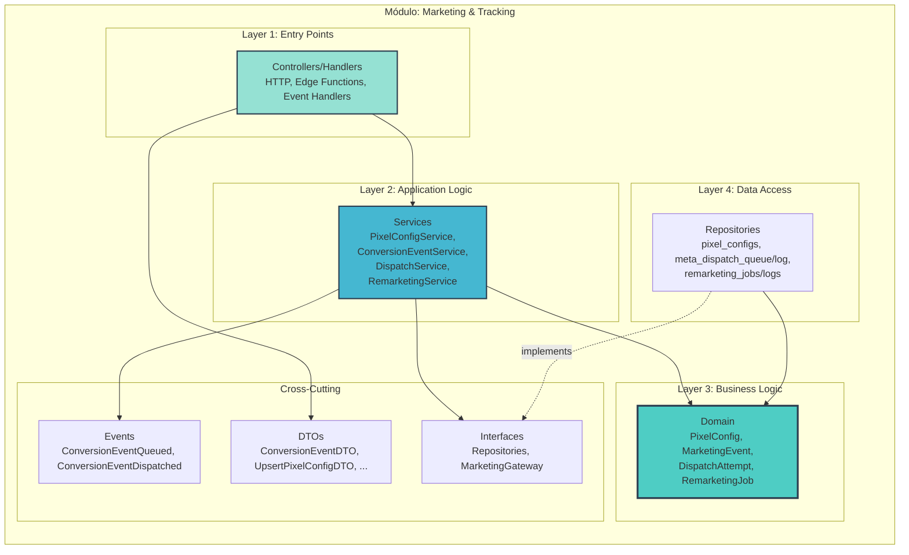

---

## Layer 1: Controllers/Handlers (Entry Points)

### Fontes de Entrada

- **Eventos internos** (via serviços de SDR/CRMs):  
  `LeadCreatedEvent`, `LeadQualifiedEvent`, `DealStatusChangedEvent`, `ContractSignedEvent`.
- **HTTP/Edge Functions**:
  - Administração de `pixel_configs` (back-office).
  - Criação de `remarketing_jobs`.
- **Workers agendados**:
  - `meta-queue-worker` para despachar eventos de conversão.
- **Callbacks do micro-serviço** (opcional):
  - Webhook de confirmação/falha adicional.

### Diagrama de Componentes (Entry Points)

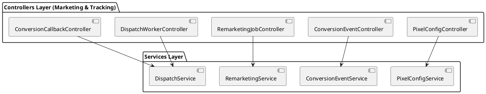

### Estrutura de Arquivos (sugestão)

```text
modules/marketing/controllers/
 ├── pixel-config.controller.ts
 ├── conversion-event.controller.ts
 ├── remarketing-job.controller.ts
 ├── dispatch-worker.controller.ts
 └── conversion-callback.controller.ts
```

### Guidelines

- Endpoints administrativos:
  - Exigem JWT com `company_id` + role `backoffice_admin` ou `marketing_admin`.
- Handlers internos (chamados por SDR/CRMs ou via service role):
  - Não devem confiar em `company_id` vindo do payload; usam `leadId`/`dealId` para buscar `company_id` no core/CRM quando necessário.
- Worker (`dispatch-worker`):
  - Só usa `company_id` que está nos registros de fila (`meta_dispatch_queue`).

---

## Layer 2: Services (Application Logic)

### Services Principais

- **PixelConfigService**
  - CRUD de configurações de pixel por empresa.
  - Resolve, para cada `company_id`, qual pixel está ativo.

- **ConversionEventService**
  - Recebe `ConversionEventDTO` (lead/deal + contexto de campanha).
  - Enriquece com:
    - `company_id`
    - `pixel_config` ativo (via `PixelConfigService`)
    - dados de tracking (`fb_data`, UTM, etc.).
  - Normaliza em `MarketingEvent` e enfileira (`meta_dispatch_queue`).

- **DispatchService**
  - Processa fila de eventos:
    - Seleciona itens pendentes.
    - Envia para micro-serviço (`MarketingEventGateway`).
    - Registra resultado em `meta_dispatch_log`.

- **RemarketingService**
  - Cria `remarketing_jobs` (segmento de leads/deals).
  - Gera `remarketing_logs` para cada target.
  - Pode acionar micro-serviço para criar audiências externas.

### Diagrama de Componentes (Services + Ports)

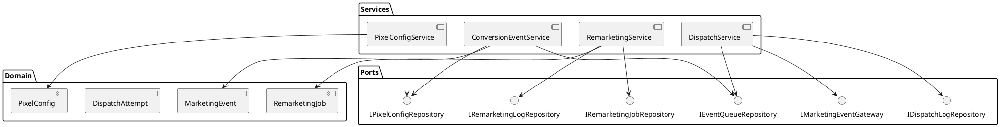

### Fluxo: Registrar Evento de Conversão

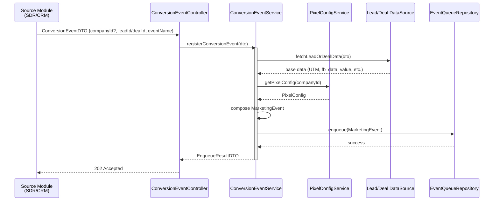

---

## Layer 3: Domain (Business Logic)

### Entidades Principais

**PixelConfig**

- `id`, `companyId`
- `pixelId text`
- `metaAccessToken` (armazenado de forma segura)
- `metaTestEventCode text?`
- `domain text?`
- `isActive boolean`

Regras:

- Apenas pixels marcados como `isActive = true` devem ser usados para dispatch.
- Tokens nunca são expostos fora da camada de infra/gateway.

**MarketingEvent**

- `companyId`, `pixelConfigId`
- `eventName` (ex: `"Lead"`, `"Purchase"`, `"CompleteRegistration"`)
- `eventTime`
- `userData` (hashes e campos exigidos pela API de conversão)
- `customData` (valor, moeda, etc.)
- `eventSourceUrl`

**DispatchAttempt**

- `queueItemId`
- `attempts`
- `status` (`pending`, `processing`, `success`, `failed`)
- `lastError`, `responseStatus`, `responseBody`, `responseHeaders`.

**RemarketingJob**

- `companyId`
- `audienceType`
- `payload jsonb` (critérios, filtros)
- `deliveryMethod`
- `status`
- `scheduledAt`, `createdAt`, `updatedAt`.

### Diagrama de Classes

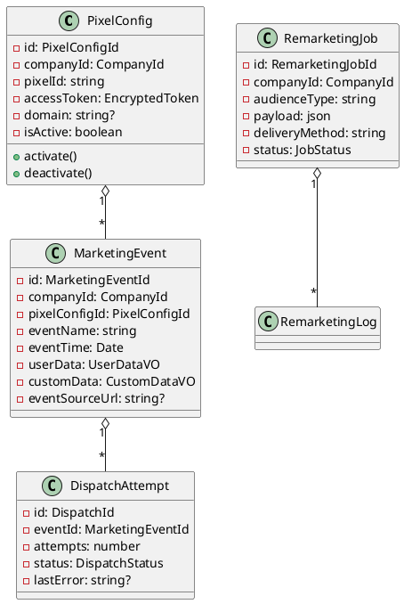

---

## Layer 4: Repository (Data Access)

### Tabelas Relacionadas (conceitual)

Dependendo da estratégia, estas tabelas podem ficar no schema de cada CRM (ex.: `heart`) ou em um schema compartilhado de marketing (`core_marketing`). A modelagem é a mesma; muda apenas o schema.

```text
pixel_configs
- id uuid PK
- company_id uuid FK -> core.companies.id
- pixel_id text NOT NULL
- meta_access_token text
- meta_test_event_code text NULL
- domain text NULL
- is_active boolean NOT NULL
- created_at timestamptz
- updated_at timestamptz

meta_dispatch_queue
- id bigserial PK
- company_id uuid
- pixel_config_id uuid
- event_name text
- request_payload jsonb
- status text ('pending','processing','failed','completed')
- attempts int
- last_attempt_at timestamptz
- last_error text
- created_at timestamptz
- updated_at timestamptz

meta_dispatch_log
- id bigserial PK
- company_id uuid
- pixel_config_id uuid
- event_name text
- status_code int
- success boolean
- request_payload jsonb
- response_body jsonb
- response_headers jsonb
- error_message text
- created_at timestamptz
```

### Interfaces de Repositório

```typescript
export interface IPixelConfigRepository {
  upsert(config: PixelConfig): Promise<void>;
  findActiveByCompany(companyId: CompanyId): Promise<PixelConfig | null>;
  listByCompany(companyId: CompanyId): Promise<PixelConfig[]>;
}

export interface IEventQueueRepository {
  enqueue(event: MarketingEvent): Promise<void>;
  fetchPending(limit: number): Promise<MarketingEvent[]>;
  markProcessing(eventId: MarketingEventId): Promise<void>;
  markResult(eventId: MarketingEventId, result: DispatchResult): Promise<void>;
}

export interface IDispatchLogRepository {
  log(result: DispatchResult): Promise<void>;
}
```

---

## Integração com Outros Módulos

### Eventos Consumidos

- `LeadCreatedEvent`, `LeadQualifiedEvent` (core.sdr)
- `DealCreatedEvent`, `DealStatusChangedEvent`, `ContractSignedEvent` (schemas de CRM)

Handlers convertem esses eventos em `ConversionEventDTO` e chamam `ConversionEventService`.

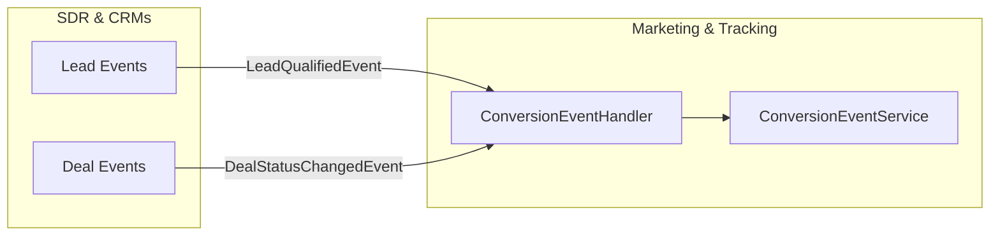

### Eventos Publicados

- `ConversionEventQueuedEvent`
- `ConversionEventDispatchedEvent`
- `ConversionEventFailedEvent`
- `RemarketingJobCreatedEvent`
- `RemarketingJobCompletedEvent`

Esses eventos podem alimentar dashboards/analytics internos.

### MarketingEventGateway

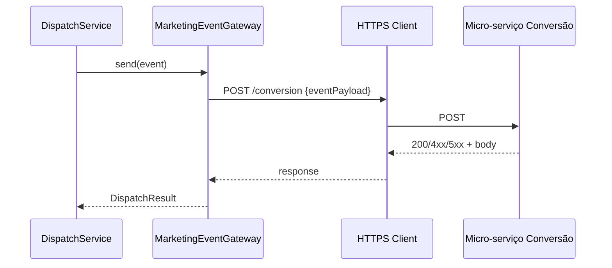

---

## Segurança & Multi-Tenancy

- Todas as tabelas deste módulo possuem `company_id`.
- RLS:
  - Usuários CRM só podem ver configs/logs da própria empresa (`company_id` do JWT).
  - Workers com `service_role` podem processar múltiplas empresas, mas o código deve sempre respeitar o escopo de cada registro.

---

## Resumo

O módulo **Marketing & Tracking**:

- Centraliza a inteligência de tracking e integração com o micro-serviço de conversão/ads.
- Fica pluggado em cima do `core` e de múltiplos schemas de CRM, sempre por `company_id`.
- Expõe contratos claros (DTOs, eventos, repositórios) para que qualquer CRM schema possa disparar eventos de marketing de forma padronizada.

---

# Arquitetura Micro: Governança & Empresas (core.companies) v1.0

**Documento ID:** ARCH-core-companies-v1  
**Módulo:** Governança & Empresas  
**Bounded Context:** Company Management & Tenant Governance  
**Data de Criação:** 2025-11-14  
**Baseado em:** ARCH-MACRO-v2.0  
**Status:** Draft  

---

## Visão Geral do Módulo

### Propósito e Responsabilidade

**Responsabilidade Única (SRP):**  
Gerenciar o ciclo de vida das **empresas da holding (tenants)** e seus vínculos com usuários e CRMs, garantindo governança e isolamento multi-tenant em todo o sistema.

**Bounded Context:**

Este módulo é o coração da governança multi-tenant. Ele define o que é uma **empresa** no sistema, quais usuários pertencem a cada empresa, quais CRMs (schemas) estão ativos para cada uma, e quais ativos operacionais (Centurions, instâncias WhatsApp, pixels, etc.) pertencem a qual empresa. Toda decisão de roteamento de leads, escopo de acesso e visibilidade de dados começa aqui.

**Por que este módulo existe:**

- Garantir que **tudo** (leads, instâncias, CRMs, pixels, contratos) esteja sempre vinculado a uma empresa (`company_id`).
- Permitir que o dono da holding administre, a partir de um **back-office único**, múltiplas empresas e seus CRMs.
- Ser a **fonte de verdade** para isolamento de dados e políticas de acesso (RLS, JWT claims, roles).

---

### Localização na Arquitetura Macro

**Referência:** ARCH-MACRO-v2.0 → Módulo “Governança & Empresas (core)”

```mermaid
graph TB
    subgraph "Sistema Completo"
        M1[SDR & Back-office (core.sdr)]
        M2[CRMs Operacionais (schemas)]
        TARGET[🎯 ESTE MÓDULO<br/>Governança & Empresas]
        M3[Marketing & Tracking]
    end
    
    TARGET -->|company_id, políticas| M1
    TARGET -->|company_id, binding schema| M2
    TARGET -->|company_id, configs| M3
    M1 -->|lead.company_id| TARGET
    M2 -->|crm_schema por empresa| TARGET
    
    style TARGET fill:#ff6b6b,stroke:#2c3e50,stroke-width:4px
```

---

### Capacidades Principais

| Operação              | Tipo    | Descrição                                                        | Input                   | Output                 |
|-----------------------|---------|------------------------------------------------------------------|-------------------------|------------------------|
| Criar empresa         | Command | Cria uma nova empresa/tenant e configura defaults               | `CreateCompanyDTO`      | `CompanyDetailsDTO`    |
| Gerenciar usuários    | Command | Adiciona/remove/atualiza usuários vinculados à empresa          | `UpsertCompanyUserDTO`  | `CompanyUserDTO`       |
| Configurar CRMs       | Command | Habilita/desabilita schemas CRM (ex: `heart`) para a empresa    | `ConfigureCompanyCrmDTO`| `CompanyCrmConfigDTO`  |
| Listar empresas       | Query   | Lista empresas e resumo de ativos/CRMs                          | `ListCompaniesFilterDTO`| `CompanyListItemDTO[]` |
| Resolver roteamento   | Query   | Dado `lead_id`, resolve empresa e CRM destino                   | `ResolveLeadRoutingDTO` | `LeadRoutingDecisionDTO`|

---

## Arquitetura Interna de Camadas

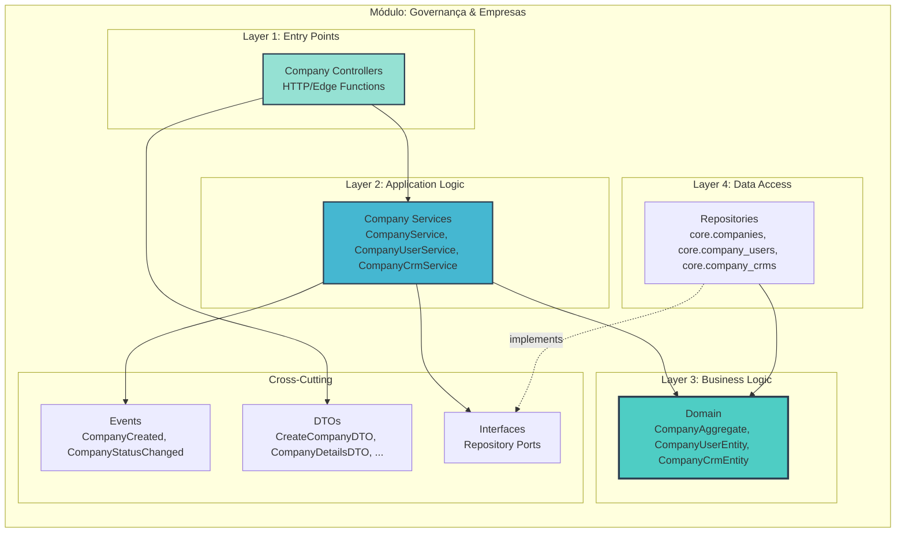

### Domain (conceito)

- **CompanyAggregate** – empresa da holding:
  - `id`, `name`, `slug`, `document`, `status`, `ownerUserId`, `settings`.
  - Regras de estado (`active`, `suspended`, `archived`).
- **CompanyUserEntity** – vínculo usuário ↔ empresa:
  - `companyId`, `userId`, `role`, `scopes`.
- **CompanyCrmEntity** – CRM/schema habilitado para empresa:
  - `companyId`, `schemaName`, `isPrimary`, `config`.

### Repositórios (interfaces)

```typescript
export interface ICompanyRepository {
  save(company: CompanyAggregate): Promise<void>;
  findById(id: CompanyId): Promise<CompanyAggregate | null>;
  findBySlug(slug: CompanySlug): Promise<CompanyAggregate | null>;
  existsBySlugOrDocument(slug: CompanySlug, document: CompanyDocument): Promise<boolean>;
  list(filter: ListCompaniesFilterDTO): Promise<CompanyAggregate[]>;
}
```

### Layer 1: Controllers (Entry Points)

**Principais controllers (back-office):**

- `CompanyController`
  - Rotas:
    - `POST /admin/companies` → criar empresa (`CreateCompanyDTO`)
    - `GET /admin/companies` → listar empresas (`ListCompaniesFilterDTO`)
    - `GET /admin/companies/:id` → detalhes (`CompanyDetailsDTO`)
    - `PATCH /admin/companies/:id` → atualizar nome/status/settings
- `CompanyUserController`
  - Rotas:
    - `POST /admin/companies/:id/users` → adicionar/atualizar usuário da empresa
    - `DELETE /admin/companies/:id/users/:userId` → remover usuário
    - `GET /admin/companies/:id/users` → listar equipe da empresa
- `CompanyCrmController`
  - Rotas:
    - `POST /admin/companies/:id/crms` → habilitar CRM/schema
    - `PATCH /admin/companies/:id/crms/:crmId` → alterar `is_primary`, config
    - `GET /admin/companies/:id/crms` → listar CRMs da empresa

**Regras de acesso:**

- Todos os endpoints exigem:
  - `auth.jwt()->>'role' = 'backoffice_admin'` (ou equivalente).
- Nenhum endpoint de CRM/SDR chamará estes controllers diretamente; eles são exclusivos do **back-office**.

### Layer 2: Services

**`CompanyService`**

- `createCompany(dto: CreateCompanyDTO): Promise<CompanyDetailsDTO>`
  - Normaliza `slug` a partir de `name`.
  - Garante unicidade (`existsBySlugOrDocument`).
  - Cria `CompanyAggregate` com estado inicial `active`.
  - Persiste via `ICompanyRepository`.
  - Publica `CompanyCreatedEvent`.
- `updateCompany(id, dto): Promise<CompanyDetailsDTO>`
  - Permite mudar nome, status, settings.
  - Valida transições de status (ex.: `archived` é terminal).
- `listCompanies(filter): Promise<CompanyListItemDTO[]>`

**`CompanyUserService`**

- `upsertCompanyUser(dto: UpsertCompanyUserDTO)`
  - Garante que `user_id` exista em `auth.users` (via port ou função Supabase).
  - Cria/atualiza `CompanyUserEntity` para um `companyId`.
  - Regra: sempre deve existir pelo menos um `owner` por empresa (business rule).
- `removeCompanyUser(companyId, userId)`
  - Impede remoção do último `owner`.

**`CompanyCrmService`**

- `configureCompanyCrm(dto: ConfigureCompanyCrmDTO)`
  - Valida `schemaName` contra lista de schemas CRM suportados.
  - Garante no máximo um `is_primary = true` por `companyId`.
  - Salva `CompanyCrmEntity`.
- `resolveRoutingForLead(leadId: UUID): LeadRoutingDecisionDTO`
  - Consulta `core.leads` → `company_id`.
  - Consulta `core.company_crms` → `schema_name` primário.
  - Retorna `companyId`, `schemaName`, `targetResource` (ex.: `"deals"`).

### Layer 3: Domain – Invariantes e Estados

**Estados de `CompanyStatus`:**

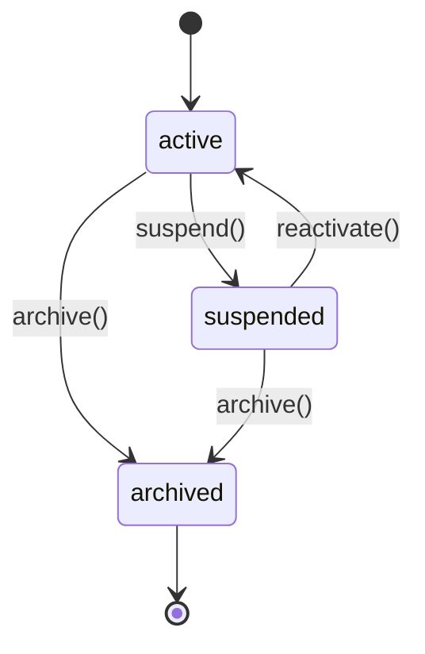

**Invariantes importantes:**

- `slug` nunca muda após criação (ou muda de forma muito controlada).
- `document` (CNPJ/CPF) se presente deve ser único entre empresas.
- Uma empresa `archived`:
  - Não pode receber novos usuários (apenas leitura).
  - Não pode receber novos CRMs (apenas consulta).
- Para cada empresa:
  - Deve haver **no mínimo** um usuário com `role = 'owner'`.
  - Pode haver no máximo um `CompanyCrmEntity` com `is_primary = true`.

### Layer 4: Data Model (core.companies, core.company_users, core.company_crms)

**`core.companies` (conceitual):**

- `id uuid PK`
- `name text NOT NULL`
- `slug text UNIQUE NOT NULL`
- `document text NULL` (CNPJ/CPF)
- `status text NOT NULL DEFAULT 'active'`
- `owner_user_id uuid NULL` (FK → `auth.users.id`)
- `settings jsonb NOT NULL DEFAULT '{}'::jsonb`
- `created_at timestamptz NOT NULL DEFAULT now()`
- `updated_at timestamptz NOT NULL DEFAULT now()`

**`core.company_users`:**

- `id uuid PK`
- `company_id uuid NOT NULL FK → core.companies.id`
- `user_id uuid NOT NULL FK → auth.users.id`
- `role text NOT NULL` (`owner`, `admin`, `operator`, `viewer`, `sales_rep`, etc.)
- `scopes text[] NOT NULL DEFAULT '{}'::text[]`
- `created_at timestamptz NOT NULL DEFAULT now()`
- `updated_at timestamptz NOT NULL DEFAULT now()`

**`core.company_crms`:**

- `id uuid PK`
- `company_id uuid NOT NULL FK → core.companies.id`
- `schema_name text NOT NULL` (ex.: `'heart'`, `'law_crm'`)
- `is_primary boolean NOT NULL DEFAULT false`
- `config jsonb NOT NULL DEFAULT '{}'::jsonb`
- `created_at timestamptz NOT NULL DEFAULT now()`
- `updated_at timestamptz NOT NULL DEFAULT now()`

### RLS & Claims JWT

Para estas tabelas, normalmente:

- **Back-office** (role `backoffice_admin`) tem acesso total:

```sql
CREATE POLICY "companies_admin_all"
ON core.companies
FOR ALL
USING  (auth.jwt()->>'role' = 'backoffice_admin')
WITH CHECK (auth.jwt()->>'role' = 'backoffice_admin');
```

- Usuários de CRM **não** acessam diretamente `core.companies`/`core.company_users` em rotas normais; o acesso é via views/funções controladas pelo back-office.

JWT típico para usuários de CRM:

- `sub` → `auth.users.id`
- `company_id` → empresa à qual o usuário está logado no momento.
- `role` → `crm_user` / `sales_rep` / `manager` etc.


---

# Arquitetura Micro: SDR & Leads (core.sdr) v1.0

**Documento ID:** ARCH-core-sdr-v1  
**Módulo:** SDR & Leads (core.sdr)  
**Bounded Context:** SDR Multicanal & Orquestração de Conversas  
**Data de Criação:** 2025-11-14  
**Baseado em:** ARCH-MACRO-v2.0  
**Status:** Draft  

---

## Visão Geral do Módulo

**Responsabilidade Única (SRP):**  
Orquestrar todo o ciclo de vida de leads e conversas automatizadas (WhatsApp + Centurions) em modo multi-empresa, até o handoff para o CRM específico de cada empresa.

**Bounded Context:**

Responsável por tudo entre o primeiro contato (WhatsApp, captura, input externo) e a qualificação/handoff do lead:

- Criação/atualização de leads canônicos (`core.leads`).
- Gestão de conversas (`core.conversations`, `core.messages`).
- Qualificação via Centurions (IA).
- Follow-ups, eventos de funil, métricas.
- Handoff para schemas de CRM (ex.: `heart`).

---

### Localização na Arquitetura Macro

```mermaid
graph TB
    subgraph "Sistema Completo"
        GOV[Governança & Empresas]
        TARGET[🎯 SDR & Leads (core.sdr)]
        CRMS[CRMs (schemas heart, x, y...)]
        MKT[Marketing & Tracking]
    end
    
    GOV -->|company_id, assets| TARGET
    TARGET -->|Lead Handoff| CRMS
    TARGET -->|Conversion Events| MKT
    
    style TARGET fill:#ff6b6b,stroke:#2c3e50,stroke-width:4px
```

---

## Arquitetura Interna de Camadas

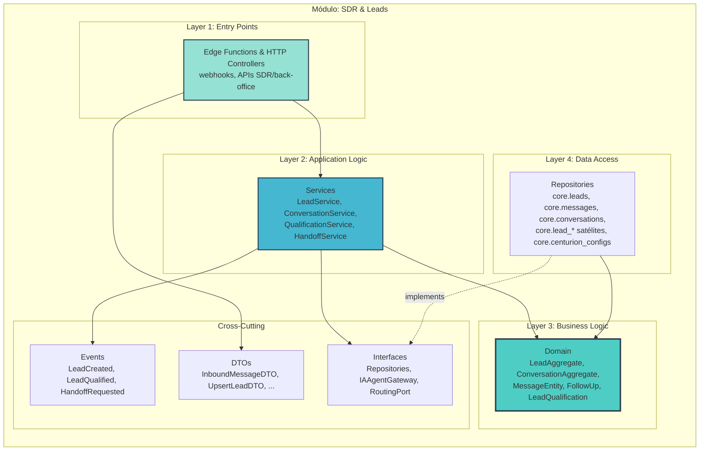

### Entidades-chave

- **LeadAggregate** (`core.leads` + satélites `lead_events`, `lead_follow_ups`, etc.)
- **ConversationAggregate** (`core.conversations` + `core.messages`)
- **CenturionConfig** (`core.centurion_configs`)

### Fluxo Webhook WhatsApp (alto nível)

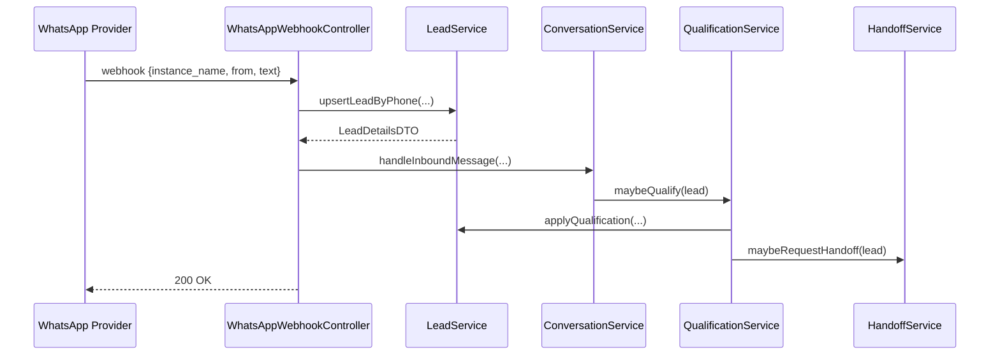

---

# SDR & Leads – Detalhamento por Camada

## Layer 1: Controllers / Entry Points

**Principais entry points:**

- `WhatsAppWebhookController` (Edge Function `agno-process-message`)
  - Recebe webhooks do provider (Evolution ou similar).
  - Extrai `instance_name`, `from` (telefone), `body` da mensagem, media, metadata.
  - Resolve `company_id` via:
    - `instance_name` → `core.instance_centurion_mapping` → `company_id`.
  - Chama `LeadService.upsertLeadByPhone` e `ConversationService.handleInboundMessage`.

- `ProactiveJobController` (Edge Function `proactive-bulk-trigger`)
  - Executado por cron/worker.
  - Lê `core.lead_proactive_assignments` e `core.centurion_configs` para selecionar leads elegíveis.
  - Enfileira mensagens proativas (via `ConversationService`).

- `LeadAdminController`
  - Rotas para UI do back-office / SDR:
    - `GET /sdr/leads` → listar leads por filtros (empresa, estágio, Centurion, tags).
    - `PATCH /sdr/leads/:id` → atualizar dados/estágio/qualificação manualmente.
    - `POST /sdr/leads/:id/follow-ups` → criar follow-up.

**Regras de acesso:**

- Endpoints públicos (webhook):
  - Protegidos por token/secret do provider (header/signature).
  - Não exigem JWT, mas sempre resolvem `company_id` via mapeamento interno.
- Endpoints autenticados:
  - JWT com `company_id` e roles (`sdr_operator`, `backoffice_admin` etc.).

## Layer 2: Services

**`LeadService`**

Responsável por:

- `upsertLeadByPhone({companyId, phone, name?, email?, source})`
  - Busca lead existente por `companyId + phone`.
  - Se não existir, cria `LeadAggregate` com `lifecycle_stage = 'new'`.
  - Atualiza campos opcionais (nome/email) se vierem mais completos.
- `updateLeadStage(leadId, companyId, newStage)`
  - Chama método de domínio `LeadAggregate.changeStage`.
  - Persiste e dispara `LeadStageChangedEvent`.
- `applyQualification(leadId, companyId, result)`
  - Atualiza `is_qualified`, `qualification_score`, `qualification_data`.
  - Pode mover lead automaticamente para `qualified`/`closed_lost`.
- `scheduleFollowUp(dto: ScheduleFollowUpDTO)`
  - Cria/atualiza `FollowUpEntity` (`core.lead_follow_ups`).

**`ConversationService`**

- `handleInboundMessage({companyId, instanceName, phone, text, media})`
  - Recupera/gera `LeadAggregate`.
  - `getOrCreateConversation(leadId, companyId, centurionId)` – baseado em mapeamento instância ↔ Centurion.
  - Cria `MessageEntity` inbound.
  - Atualiza `ConversationAggregate` (presença, `last_inbound_at`, `queue_depth`).
  - Envia evento para `QualificationService` decidir se deve acionar IA.

- `sendOutboundMessage({conversationId, content, centurionId})`
  - Cria `MessageEntity` outbound.
  - Atualiza estado da conversa (debounce, presença).
  - Dispara Edge Function de envio via provider WhatsApp (outro módulo de infra).

**`QualificationService`**

- Decide **quando** acionar IA:
  - Após certas palavras-chave, mudança de estágio, ou timeout.
- Usa `IIAAgentGateway`:
  - Constrói contexto a partir de:
    - Histórico de conversas (`core.messages` recentes).
    - Config do Centurion (`core.centurion_configs`).
    - Conhecimento adicional (base de conhecimento, `agent_knowledge_base` se for o caso).
  - Recebe resposta (textos, decisões, score).
  - Atualiza `LeadAggregate` (qualificação e estágio).
  - Pode gerar mensagens automáticas (via `ConversationService`).

**`HandoffService`**

- `requestHandoff(leadId, companyId)`
  - Verifica se critérios de handoff foram atingidos (regra de negócio).
  - Registra em `core.lead_handoffs` (`status = 'pending'`).
  - Chama `ICompanyRoutingPort` (Governança) para resolver CRM/schema.
  - Dispara evento/Edge Function para CRM de destino (`heart`, etc.).

## Layer 3: Domain – Estados & Entidades

### LeadAggregate – máquina de estados

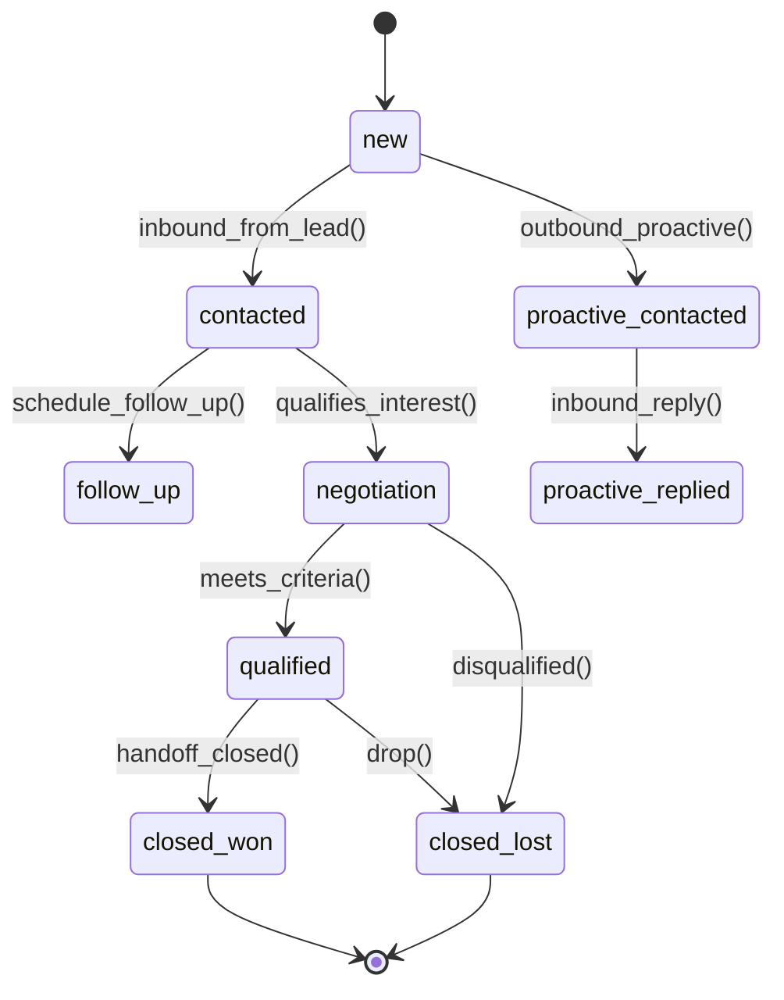

### ConversationAggregate – regras principais

- Nunca responder se:
  - `debounce_until > now()`
  - `presence` indica que já há outra resposta em andamento.
- `queue_depth` ajuda a decidir se é seguro enviar mais mensagens (para evitar flood).

## Layer 4: Data Model (principais tabelas core.sdr)

**`core.leads`** – já descrita na macro; aqui reforçamos:

- Índices recomendados:
  - `idx_leads_company_phone (company_id, phone)`
  - `idx_leads_company_lifecycle (company_id, lifecycle_stage)`

**`core.conversations`** (conceitual):

- `id uuid PK`
- `company_id uuid`
- `lead_id uuid`
- `centurion_id text`
- `agent_state text`
- `lead_state text`
- `presence text`
- `debounce_until timestamptz`
- `last_inbound_at`, `last_outbound_at`
- `queue_depth int`
- `metadata jsonb`

**`core.messages`**:

- `id uuid PK`
- `company_id uuid`
- `lead_id uuid`
- `conversation_id uuid`
- `direction text` (`inbound`/`outbound`)
- `channel text` (`whatsapp`)
- `content text`
- `status text`
- `metadata jsonb` (WABA message ids, etc.)

**`core.lead_follow_ups`**, `core.lead_qualifications`, `core.lead_events` seguem o padrão satélite: sempre `company_id`, `lead_id`, dados específicos, `created_at`/`updated_at`.

## Integração com Governança & CRMs

- Usa `company_id` de:
  - Webhook (derivado de instância).
  - JWT (para APIs SDR internas).
- Para handoff:
  - Chama `Governança` para `resolveRoutingForLead(leadId)`.
  - Usa portas específicas para cada CRM (ex.: `HeartHandoffPort` para schema `heart`).

---
# Arquitetura Micro: CRM Operacional Heart (schema `heart`) v1.0

**Documento ID:** ARCH-heart-crm-v1  
**Módulo:** CRM Operacional Heart  
**Bounded Context:** Sales Pipeline & Operação Comercial por Empresa  
**Data de Criação:** 2025-11-14  
**Baseado em:** ARCH-MACRO-v2.0  
**Status:** Draft  

---

## Visão Geral do Módulo

**Responsabilidade Única (SRP):**  
Gerenciar o **pipeline de vendas, contratos e operação comercial diária** para empresas que usam o CRM Heart, consumindo leads qualificados do SDR.

**Contexto:**

- Heart é um **schema de CRM** específico (`heart`), um entre vários possíveis (`law_crm`, `saas_crm`, etc.).
- Sempre opera com `company_id`; cada empresa tem seu conjunto de deals, serviços, contratos e equipe.
- Integra com:
  - `core` (governança, leads, contratos globais).
  - Módulo de Marketing & Tracking (eventos de conversão/remarketing).

---

## Arquitetura Interna de Camadas

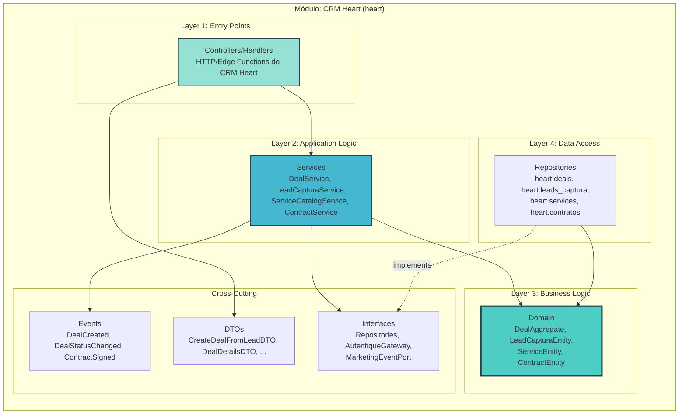

### Entidades Principais

- **DealAggregate** (`heart.deals`)
- **LeadCapturaEntity** (`heart.leads_captura`)
- **ServiceEntity** (`heart.services`)
- **ContractEntity** (`heart.contratos` / integração com `core.contracts`)

### Fluxo: Criar Deal a partir de Lead Qualificado

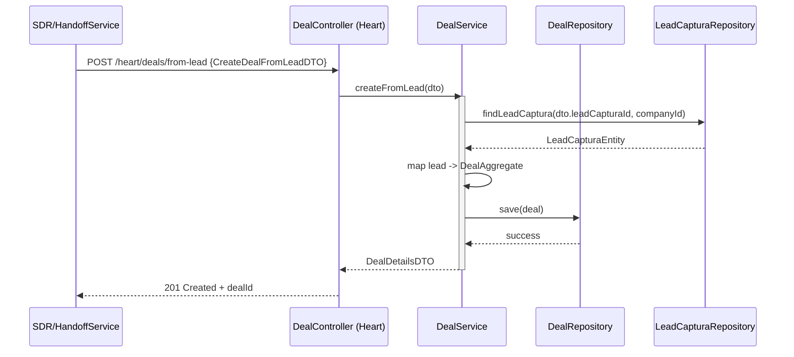

---

## CRM Heart – Detalhamento por Camada

### Layer 1: Controllers

**Controllers típicos do CRM Heart:**

- `DealController`
  - `GET /heart/deals` → lista pipeline (filtros por status, vendedor, período).
  - `GET /heart/deals/:id` → detalhes de negócio.
  - `POST /heart/deals/from-lead` → criação a partir de lead/handoff.
  - `PATCH /heart/deals/:id/status` → mudança de etapa (`deal_status`).
- `LeadCapturaController`
  - `GET /heart/leads-captura` → listagem.
  - `POST /heart/leads-captura` → criação manual ou via landing.
- `ServiceCatalogController`
  - `GET /heart/services` / `POST /heart/services` / `PATCH /heart/services/:id`.
- `ContractController`
  - `POST /heart/deals/:id/contracts` → gerar contrato.
  - `GET /heart/deals/:id/contracts` → listar histórico de contratos.

Todos exigem JWT com:

- `company_id` → limita dados ao tenant.
- Claim de role (`sales_rep`, `manager`, `crm_admin`) → controla operações.

### Layer 2: Services

**`DealService`**

- `createFromLead(dto: CreateDealFromLeadDTO): Promise<DealDetailsDTO>`
  - Recebe identificadores de lead (no core/Heart) + `company_id`.
  - Copia dados de contato, scoring, UTM para `DealAggregate`.
  - Opcionalmente vincula a `ServiceEntity` com base em regras (ex.: tipo de negócio).
- `updateStatus(dealId, companyId, newStatus)`
  - Aplica regras de mudança de etapa (máquina de estados).
  - Dispara `DealStatusChangedEvent`.
- `attachFile(dealId, type, storagePath)`
  - Atualiza campos de documentos (RG, CNH, comprovante, áudio).

**`LeadCapturaService`**

- `createOrUpdateLeadCaptura(dto)`
  - Modela leads pré-deal (por exemplo, vindos de site ou de consultoria).
  - Usado tanto por Heart quanto por pipelines externos de captura.

**`ServiceCatalogService`**

- Garante que cada `ServiceEntity`:
  - Tenha valor padrão consistente (`valor_padrao`).
  - Estabeleça relação com `contrato_template_id` (no Heart ou core).

**`ContractService`**

- Orquestra geração/gestão de contratos:
  - Usa `IAutentiqueGateway` para criar documentos de assinatura.
  - Atualiza `ContractEntity` com `status`, `document_id_autentique`, URLs.
  - Dispara `ContractGeneratedEvent` e `ContractSignedEvent` (quando receber webhook).

### Layer 3: Domain – Regras do Deal

**Estados de `deal_status` em Heart (exemplo):**

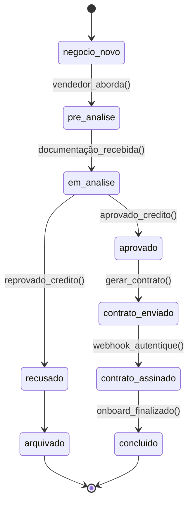

**Invariantes de `DealAggregate`:**

- Não é permitido mudar `deal_status` de `arquivado` ou `concluido` para estados anteriores.
- Após `contrato_assinado`, campos críticos (valor, nº de parcelas) não podem ser alterados sem seguir um fluxo explícito de retificação (fora de escopo inicial).

### Layer 4: Data Model (schema heart)

**`heart.deals` (detalhado):**

- `id uuid PK`
- `company_id uuid NOT NULL`
- `deal_first_name text`, `deal_last_name text`, `deal_full_name text`
- `deal_phone text`, `deal_email text`
- `deal_cpf text`, `deal_rg text`
- Endereço (`deal_rua`, `deal_numero`, `deal_bairro`, `deal_cidade`, `deal_estado`, `deal_cep`)
- Serviço e valor:
  - `deal_servico text`
  - `service_id uuid NULL fk → heart.services.id`
  - `deal_valor_contrato numeric`
  - `deal_forma_pagamento text`
  - `deal_parcelas int`
  - `parcelas_datas jsonb`
- Documentos:
  - `deal_documento_frente text`
  - `deal_documento_verso text`
  - `deal_audio text`
  - `deal_copia_contrato_assinado text`
  - `deal_comprovante_residencia text`
- Workflow:
  - `deal_status text`
  - `motivo_rejeicao text`
  - `vendedor_responsavel uuid`
  - `data_primeira_parcela date`
  - `data_nascimento date`
- Tracking:
  - `pixel_config_id uuid NULL`
  - `contact_fingerprint text`
  - UTM fields (`utm_campaign`, `utm_source`, etc.)
- Auditoria:
  - `created_at`, `updated_at`

**`heart.services`**, `heart.leads_captura`, `heart.contratos`, `heart.equipe` seguem padrão semelhante, sempre com `company_id` e FK entre si conforme descrito na macro.

### Integração com Módulos

- Recebe handoff do SDR (via `HandoffService` do core) para criar deals.
- Envia eventos de:
  - `DealStatusChangedEvent` → usado pelo módulo de Marketing & Tracking.
  - `ContractSignedEvent` → usado tanto por Marketing quanto por relatórios globais.

---

Essas seções agora trazem, no mesmo `backend.md`, versões enriquecidas das micro-arquiteturas:

- Governança & Empresas (`core.companies`)
- SDR & Leads (`core.sdr`)
- CRM Heart (`heart`)
- Marketing & Tracking (já detalhado acima)

---

# Arquitetura Micro: Integrações & Contratos Globais v1.0

**Documento ID:** ARCH-integrations-v1  
**Módulo:** Integrações & Contratos Globais  
**Bounded Context:** Integration Hub & Contract Orchestration  
**Data de Criação:** 2025-11-14  
**Baseado em:** ARCH-MACRO-v2.0  
**Status:** Draft  

---

## Visão Geral do Módulo

### Propósito e Responsabilidade

**Responsabilidade Única (SRP):**  
Ser o **hub central de integrações externas** (Autentique, WhatsApp provider/Evolution, APIs externas auxiliares) e a camada de **contratos globais** (templates e instâncias) que podem ser utilizados por qualquer CRM schema.

**Bounded Context:**

Este módulo governa:

- **Templates de contrato globais** (`core.contract_templates`) e instâncias (`core.contracts`).
- Integrações com **Autentique**:
  - Criação de documentos para assinatura.
  - Tratamento de webhooks de assinatura.
- Integrações com **WhatsApp provider (Evolution)**:
  - Webhooks de status e mensagens de instância.
  - Ações de controle (conectar/desconectar instâncias, ler QR code, etc.).
- **Configurações de ambiente e segredos** (`core.environment_configurations`) usados por todas as integrações.

Ele não decide “qual CRM” usar nem “como” a venda é conduzida; ele expõe serviços reutilizáveis para que SDR/CRMs plugados consigam:

- Gerar contratos padronizados.
- Enviar e acompanhar assinaturas.
- Operar instâncias de WhatsApp de forma multi-empresa.

---

### Localização na Arquitetura Macro

```mermaid
graph TB
    subgraph "Sistema Completo"
        CORE[Core / SDR & Back-office]
        GOV[Governança & Empresas]
        CRMS[CRMs (heart, schema_x, ...)]
        MKT[Marketing & Tracking]
        TARGET[🎯 ESTE MÓDULO<br/>Integrações & Contratos Globais]
        AUT[Autentique API]
        EVO[WhatsApp Provider (Evolution)]
        EXT[Outras APIs Externas]
    end
    
    GOV -->|company_id, settings| TARGET
    CORE -->|Lead/Deal info| TARGET
    CRMS -->|Solicita contrato / ações| TARGET
    MKT -->|Pode ler status de contrato| TARGET
    
    TARGET -->|HTTP/API| AUT
    TARGET -->|HTTP/Webhook| EVO
    TARGET -->|HTTP/API| EXT
    
    style TARGET fill:#ff6b6b,stroke:#2c3e50,stroke-width:4px
```

---

### Capacidades Principais

| Operação                          | Tipo    | Descrição                                                                                     | Input                    | Output                     |
|-----------------------------------|---------|-----------------------------------------------------------------------------------------------|--------------------------|----------------------------|
| Gerenciar templates de contrato   | Command | CRUD de `core.contract_templates` (globais ou por empresa)                                   | `UpsertContractTemplateDTO` | `ContractTemplateDetailsDTO` |
| Gerar contrato a partir de lead/deal | Command | Cria `core.contracts` e/ou contrato específico do CRM, aciona Autentique se necessário      | `GenerateContractDTO`    | `ContractDetailsDTO`       |
| Receber webhook de Autentique     | Command | Atualiza status de contratos com base em eventos de assinatura                               | `AutentiqueWebhookDTO`   | `WebhookAckDTO`            |
| Gerenciar instâncias WhatsApp     | Command | Ações em instâncias (status, reconexão, QR) integradas com Evolution                         | `InstanceActionDTO`      | `InstanceStatusDTO`        |
| Resolver/envia configs sensíveis  | Query   | Lê configs em `core.environment_configurations` (via views seguras) para Edge Functions      | `EnvConfigQueryDTO`      | `EnvConfigDTO`             |

---

## Arquitetura Interna de Camadas

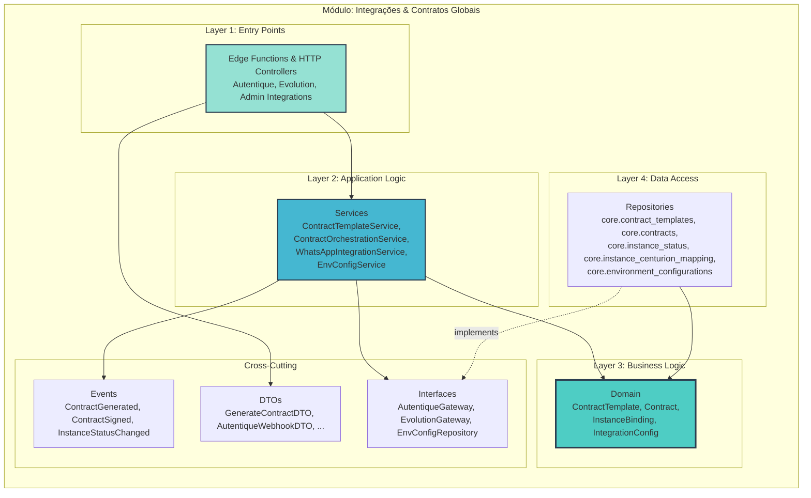

---

## Layer 1: Controllers / Edge Functions

### Entry Points para Autentique

- **`AutentiqueContractController` (core)**
  - Expõe endpoints/Edge Functions:
    - `POST /integrations/autentique/contracts` → gerar contrato (utilizado por SDR/CRMs).
    - `POST /integrations/autentique/webhook` → receber eventos (documento criado, assinado, expirado).
  - Proteção:
    - Endpoints de geração: JWT com `company_id` e role apropriada (`crm_admin`, `closer`).
    - Webhook: secret de Autentique (header token/assinatura).

### Entry Points para Evolution (WhatsApp)

- **`EvolutionWebhookController`**
  - `POST /integrations/evolution/webhook`:
    - Recebe eventos de instância: conectado, desconectado, QR codeready, erro, etc.
    - Atualiza `core.instance_status`.
  - Encaminha mensagens para `SDR & Leads` (já detalhado no módulo SDR).

- **`EvolutionInstanceActionController`**
  - `POST /integrations/evolution/instances/:name/actions`:
    - Ações como `connect`, `disconnect`, `restart`, `get_qr`.
    - Usa `WhatsAppIntegrationService`.

### Entry Points de Admin de Integrações

- `IntegrationAdminController`
  - CRUD de configurações de integrações sensíveis armazenadas em `core.environment_configurations`:
    - Chaves de API de Autentique, Evolution, etc.
  - Usa `EnvConfigService` + views seguras para nunca expor valores em claro.

---

## Layer 2: Services (Application Logic)

### `ContractTemplateService`

Responsável por `core.contract_templates`:

- `createOrUpdateTemplate(dto: UpsertContractTemplateDTO)`
  - Permite templates:
    - Globais (`company_id IS NULL`).
    - Específicos da empresa (`company_id = tenant`).
  - Mantém metadados:
    - Nome, descrição, categoria.
    - Lista de variáveis (`variables jsonb`) e tipos.
- `listTemplates(companyId, filter)`
  - Aplica regra:
    - Templates globais + templates da empresa.
- Gera `ContractTemplateVariablesDTO` para CRMs preencherem campos (nome do cliente, CPF, valor, etc.).

### `ContractOrchestrationService`

Serve tanto para SDR quanto para CRMs:

- `generateContract(dto: GenerateContractDTO): Promise<ContractDetailsDTO>`
  - Passos:
    1. Resolve `company_id` e template (`core.contract_templates` ou template do CRM).
    2. Monta payload (`payload jsonb`) com variáveis substituídas (nome, CPF, valor, etc.).
    3. Cria registro em `core.contracts` **antes** de chamar Autentique (estado `draft`).
    4. Chama `AutentiqueGateway.createDocument(payload)`.
    5. Atualiza `core.contracts` com `autentique_id`, `contract_url`, `status = 'sent'`.
    6. Dispara `ContractGeneratedEvent`.

- `syncContractStatus(autentiqueId, newStatus, webhookPayload)`
  - Chamado pelo Webhook de Autentique.
  - Atualiza `core.contracts` (e, se aplicável, `heart.contratos` ou contrato do CRM).
  - Se `status = 'signed'`, dispara `ContractSignedEvent` com `companyId`, `leadId`/`dealId`.

### `WhatsAppIntegrationService`

- Mantém a visão do estado das instâncias em `core.instance_status`:
  - `state` (`connected`, `disconnected`, `qr_ready`, `error`).
  - `phone_number`, `profile_name`, `last_connected_at`.
- Fornece métodos para Edge Functions:
  - `updateInstanceStatusFromWebhook(payload)`
  - `requestInstanceAction(instanceName, action)`: delega a Evolution via `EvolutionGateway`.
- Em conjunto com `core.instance_centurion_mapping`, permite que o SDR identifique:
  - Qual Centurion responde por qual instância.
  - Qual `company_id` está associado àquela instância.

### `EnvConfigService`

- Responsável por acesso seguro a `core.environment_configurations`:
  - Encapsula criptografia via extensões (pgcrypto/pgsodium) e `vault`.
  - Disponibiliza apenas view `decrypted_environment_configurations` para roles internas (edge functions com `service_role`).
  - Aplica categorias:
    - `ai`, `agno`, `evolution`, `autentique`, `marketing`, etc.

---

## Layer 3: Domain (Business Logic)

### Entidades de Contrato

```plantuml
@startuml
class ContractTemplate {
  - id: ContractTemplateId
  - companyId: CompanyId?  ' null => global
  - name: string
  - description: string?
  - variables: TemplateVariable[]
  - category: string
  + isGlobal(): boolean
}

class Contract {
  - id: ContractId
  - companyId: CompanyId
  - templateId: ContractTemplateId
  - leadId: LeadId?
  - dealId: DealId?
  - status: ContractStatus
  - value: MoneyVO?
  - contractData: json
  - autentiqueId: string?
  - contractUrl: string?
  + markSent()
  + markSigned()
  + markCanceled()
}

ContractTemplate "1" o-- "*" Contract
@enduml
```

**Estados de `ContractStatus`:** `draft`, `sent`, `signed`, `canceled`, `expired`.

Regras:

- Não é permitido retornar de `signed` para `draft`.
- Cancelamentos podem exigir auditoria (motivo, usuário).

### Entidades de Integrações

**InstanceBinding / InstanceStatus** (já modeladas em core.sdr, aqui vistas como parte do domínio de integrações):

- `instance_name`
- `company_id`
- `centurion_id`
- `state`
- `metadata jsonb`

**IntegrationConfig** (modelada em `core.environment_configurations`):

- `key` (ex.: `AUTENTIQUE_API_TOKEN`, `EVOLUTION_API_URL`)
- `value` (criptografado para chaves sensíveis)
- `is_sensitive`
- `category`

---

## Layer 4: Data Access

### Tabelas de Contratos (schema core)

**`core.contract_templates`** (conceito refinado):

- `id uuid PK`
- `company_id uuid NULL` (NULL = template global, não dono de uma empresa específica)
- `name varchar NOT NULL`
- `description text NULL`
- `variables jsonb NOT NULL DEFAULT '[]'::jsonb`  
  (lista de objetos `{ key, label, type, required }`)
- `category varchar NOT NULL DEFAULT 'general'`
- `active boolean NOT NULL DEFAULT true`
- `usage_count int NOT NULL DEFAULT 0`
- `created_at`, `updated_at`

**`core.contracts`**:

- `id uuid PK`
- `company_id uuid NOT NULL`
- `lead_id uuid NULL` FK → `core.leads.id`
- `deal_id uuid NULL` (para casos em que o CRM informa o negócio ligado)
- `template_id uuid NOT NULL FK → core.contract_templates.id`
- `status varchar NOT NULL DEFAULT 'draft'`
- `contract_url text NULL`
- `autentique_id text NULL`
- `contract_data jsonb NOT NULL DEFAULT '{}'::jsonb`  
  (dados mesclados no template: variáveis resolvidas)
- `value numeric NULL`
- `signed_at timestamptz NULL`
- `first_payment_at timestamptz NULL`
- `created_at`, `updated_at`

### Tabelas de Configuração e Instâncias

**`core.environment_configurations`** e views:

- Campos já descritos no macro; aqui importante:
  - `is_sensitive boolean`
  - `vault-backed` para valores que devem ser criptografados.
  - Views:
    - `decrypted_environment_configurations` (acessível apenas a roles internas).
    - `public_environment_configurations` (apenas configs não sensíveis).

**`core.instance_status`**, `core.instance_centurion_mapping`:

- Já descritas na macro e no módulo SDR; aqui são usadas como fonte de verdade de integrações com Evolution.

---

## Fluxos Principais

### 1. Geração de Contrato via Autentique

```mermaid
sequenceDiagram
    participant CRM as CRM (Heart ou outro schema)
    participant Ctl as AutentiqueContractController
    participant Orchestrator as ContractOrchestrationService
    participant TRepo as ContractTemplateRepository
    participant CRepo as ContractRepository
    participant AGW as AutentiqueGateway
    participant AUT as Autentique API

    CRM->>Ctl: POST /integrations/autentique/contracts {GenerateContractDTO}
    Ctl->>Orchestrator: generateContract(dto)
    activate Orchestrator

    Orchestrator->>TRepo: findTemplate(dto.templateId, companyId)
    TRepo-->>Orchestrator: ContractTemplate

    Orchestrator->>CRepo: create draft Contract
    CRepo-->>Orchestrator: Contract (status=draft)

    Orchestrator->>AGW: createDocument(contractPayload)
    AGW->>AUT: POST /documents
    AUT-->>AGW: 200 + {document_id, link}
    AGW-->>Orchestrator: AutentiqueResult

    Orchestrator->>CRepo: update Contract (status=sent, autentiqueId, url)
    Orchestrator-->>Ctl: ContractDetailsDTO
    deactivate Orchestrator

    Ctl-->>CRM: 201 Created + contractId
```

### 2. Webhook de Assinatura Autentique

```mermaid
sequenceDiagram
    participant AUT as Autentique
    participant HookCtl as AutentiqueWebhookController
    participant Orchestrator as ContractOrchestrationService
    participant CRepo as ContractRepository
    participant CRMs as CRMs Interessados

    AUT->>HookCtl: POST /integrations/autentique/webhook {documentId, event}
    HookCtl->>Orchestrator: handleWebhook(payload)
    Orchestrator->>CRepo: findByAutentiqueId(documentId)
    CRepo-->>Orchestrator: Contract

    Orchestrator->>Orchestrator: map event -> status
    Orchestrator->>CRepo: update status (ex: signed)
    Orchestrator-->>CRMs: publish ContractSignedEvent
    HookCtl-->>AUT: 200 OK
```

### 3. Atualização de Instância Evolution

```mermaid
sequenceDiagram
    participant EVO as Evolution
    participant EvoCtl as EvolutionWebhookController
    participant WAService as WhatsAppIntegrationService
    participant IRepo as InstanceStatusRepository
    participant SDR as SDR Module

    EVO->>EvoCtl: webhook {instance_name, status, ...}
    EvoCtl->>WAService: updateInstanceStatus(payload)
    WAService->>IRepo: upsert(instance_status)
    IRepo-->>WAService: success
    WAService-->>SDR: publish InstanceStatusChangedEvent
    EvoCtl-->>EVO: 200 OK
```

---

## Segurança & Multi-Tenancy

- Todas as entidades de contrato e instância são associadas a `company_id`.
- Secrets de integrações **nunca** saem de `core.environment_configurations`/`vault` em claro para front-ends.
- Edge Functions que usam tokens sensíveis operam com:
  - Role `service_role`.
  - Leitura apenas através da view `decrypted_environment_configurations`.
- Autentique/Evolution webhooks:
  - Validados por token secreto e, idealmente, IP allowlist (config externamente).

---

## Resumo

O módulo **Integrações & Contratos Globais**:

- Fornece uma camada única e reutilizável de **templates de contrato** e **instâncias**.
- Centraliza integrações com Autentique e Evolution, desacoplando SDR/CRMs de detalhes de APIs externas.
- Usa `core.environment_configurations` como fonte de configs/segredos para todas integrações.
- Serve como base para qualquer novo schema de CRM reutilizar contratos e infraestrutura externa de forma padronizada.

---

# Arquitetura Micro: RLS & Security v1.0

**Documento ID:** ARCH-rls-security-v1  
**Módulo:** RLS & Security  
**Bounded Context:** Multi-Tenancy, Autorização & Proteção de Dados  
**Data de Criação:** 2025-11-14  
**Baseado em:** ARCH-MACRO-v2.0  
**Status:** Draft  

---

## Visão Geral do Módulo

### Propósito e Responsabilidade

**Responsabilidade Única (SRP):**  
Definir e padronizar **toda a estratégia de segurança lógica** do banco único, incluindo:

- Modelo de **claims JWT** (Supabase Auth) para back-office, SDR, CRMs e serviços.
- Padrões de **Row Level Security (RLS)** por schema (`core`, schemas de CRM, marketing).
- Regras de **Storage RLS** para arquivos (contratos, documentos, avatares, etc.).
- Perfis lógicos de acesso (back-office admin, operadores, vendedores, workers, integrações).

Este módulo não lida com autenticação em si (isso é do Auth), mas define **como** as identidades autenticadas enxergam (ou não enxergam) os dados.

---

### Posição na Arquitetura Macro

```mermaid
graph TB
    subgraph "Sistema Completo"
        GOV[Governança & Empresas]
        SDR[SDR & Leads]
        CRM[CRMs (schemas)]
        MKT[Marketing & Tracking]
        INTEGR[Integrações & Contratos]
        AUTH[Supabase Auth]
        STORAGE[Supabase Storage]
        TARGET[🎯 ESTE MÓDULO<br/>RLS & Security]
    end
    
    AUTH -->|JWT Claims| TARGET
    TARGET -->|Policies & Guidelines| GOV
    TARGET -->|Policies & Guidelines| SDR
    TARGET -->|Policies & Guidelines| CRM
    TARGET -->|Policies & Guidelines| MKT
    TARGET -->|Policies & Guidelines| INTEGR
    TARGET -->|Bucket Policies| STORAGE
    
    style TARGET fill:#ff6b6b,stroke:#2c3e50,stroke-width:4px
```

---

## Modelo de Identidade & Claims JWT

### Papéis Lógicos Principais

- **`backoffice_admin`**  
  Dono da holding / operadores de back-office:
  - Acessam todas as empresas (`company_id` não limita).
  - Operam em `core.companies`, `core.company_users`, configurações globais, etc.

- **`crm_user` / `sales_rep` / `crm_manager`**  
  Usuários do CRM operacional:
  - Sempre operam **dentro de uma empresa** (`company_id` obrigatório).
  - Acessam apenas schemas CRM + subset de dados do `core` que lhes diz respeito.

- **`sdr_operator` / `sdr_manager`**  
  Usuários que trabalham na camada SDR (talvez com UI específica):
  - Acessam `core.leads`, `core.conversations`, etc. **apenas da empresa** (`company_id`).

- **`marketing_admin`**  
  Operadores de marketing:
  - Acessam configurações de pixels, jobs de remarketing, logs, sempre por `company_id`.

- **`service_role`** (chave secreta Supabase):
  - Usada por Edge Functions e workers.
  - Não sofre RLS por padrão, mas o código DEVE respeitar o escopo lógico (sempre filtrar por `company_id`).

### Estrutura de Claims

```jsonc
// Exemplo de payload JWT (simplificado)
{
  "sub": "uuid-do-auth-users",
  "role": "crm_user",        // ou backoffice_admin, sdr_operator, marketing_admin...
  "company_id": "uuid-da-empresa",
  "permissions": ["deals:read", "deals:write", "contracts:read"],
  "crm_schema": "heart",     // opcional: schema CRM que o usuário está usando
  "exp": 1731600000
}
```

**Regras:**

- **Usuários de CRM** sempre têm `company_id`.
- **Backoffice_admin** pode ter `company_id` **nulo** ou irrelevante; policies checam apenas `role`.
- Permissões finas (`permissions`) são usadas na camada de aplicação, não diretamente nas policies SQL (para evitar listas muito grandes).

---

## Padrões de RLS por Schema

### Esqueleto de Policy Multi-tenant

Para qualquer tabela multi-tenant com `company_id`:

```sql
-- 1) Habilitar RLS
ALTER TABLE <schema>.<table> ENABLE ROW LEVEL SECURITY;

-- 2) Policy para usuários autenticados (CRM/SDR/etc.)
CREATE POLICY "<table>_tenant_read"
ON <schema>.<table>
FOR SELECT
USING (
  company_id = (auth.jwt()->>'company_id')::uuid
);

CREATE POLICY "<table>_tenant_write"
ON <schema>.<table>
FOR INSERT, UPDATE
USING (
  company_id = (auth.jwt()->>'company_id')::uuid
) WITH CHECK (
  company_id = (auth.jwt()->>'company_id')::uuid
);
```

### Padrão para Back-office (role global)

```sql
CREATE POLICY "<table>_backoffice_all"
ON <schema>.<table>
FOR ALL
USING (auth.jwt()->>'role' = 'backoffice_admin')
WITH CHECK (auth.jwt()->>'role' = 'backoffice_admin');
```

### Padrão para Service Role (Edge Functions)

Normalmente, para tabelas sensíveis, **não** é necessário RLS especial, pois o `service_role` ignora policies. Porém, é boa prática documentar:

- As Edge Functions que usam `service_role` **devem**:
  - Filtrar sempre por `company_id` explícito.
  - Nunca retornar dados de múltiplas empresas para um cliente final.

---

## RLS em `core` (Geral)

### `core.companies`, `core.company_users`, `core.company_crms`

- `core.companies`:
  - Visível e mutável apenas por `backoffice_admin`.
- `core.company_users`:
  - `backoffice_admin` gerencia tudo.
  - `crm_admin` ou `company_owner` de cada empresa **pode ver** seus próprios usuários e, eventualmente, gerenciar invites:

```sql
CREATE POLICY "company_users_self_company_read"
ON core.company_users
FOR SELECT
USING (
  company_id = (auth.jwt()->>'company_id')::uuid
);
```

### `core.leads` e satélites

- Já exemplificado na macro:
  - Usuários autenticados com `company_id` veem apenas leads da empresa.
  - `backoffice_admin` pode ver tudo.

Outras tabelas `core.*` multi-tenant (`instance_status`, `centurion_configs`, `contracts`, etc.) seguem o mesmo padrão.

---

## RLS em Schemas de CRM

### Padrão `crm_schema` + `company_id`

Para tabelas de CRM (ex.: `heart.deals`):

```sql
ALTER TABLE heart.deals ENABLE ROW LEVEL SECURITY;

CREATE POLICY "heart_deals_tenant_read"
ON heart.deals
FOR SELECT
USING (
  company_id = (auth.jwt()->>'company_id')::uuid
);

CREATE POLICY "heart_deals_tenant_write"
ON heart.deals
FOR INSERT, UPDATE
USING (
  company_id = (auth.jwt()->>'company_id')::uuid
) WITH CHECK (
  company_id = (auth.jwt()->>'company_id')::uuid
);
```

**Opcional:** policies adicionais por cargo:

```sql
-- Apenas gerente ou admin podem apagar deals
CREATE POLICY "heart_deals_delete_managers"
ON heart.deals
FOR DELETE
USING (
  company_id = (auth.jwt()->>'company_id')::uuid
  AND (auth.jwt()->>'role' IN ('crm_manager','crm_admin'))
);
```

Para outros schemas de CRM (`schema_x`), o padrão é reaplicado:

- Sempre `company_id` na tabela.
- policies idênticas, apenas mudando schema/nome da tabela.

---

## RLS em Marketing & Tracking

### Eventos e Configurações de Pixel

- Todas as tabelas (`pixel_configs`, `meta_dispatch_queue`, `meta_dispatch_log`, `remarketing_jobs`, `remarketing_logs`) possuem `company_id`.
- Policies:

```sql
CREATE POLICY "pixel_configs_company_scope"
ON <schema>.pixel_configs
FOR ALL
USING (
  company_id = (auth.jwt()->>'company_id')::uuid
);
```

- Usuário `marketing_admin` da empresa:
  - Tem access total às configs da própria empresa.
- Back-office pode ter policies separadas se precisar ver configurações globais.

Workers (`service_role`) não precisam de policies extras, mas devem ser escritos com `company_id` como parâmetro de filtro em todas as queries relevantes.

---

## Storage: Buckets, Paths e RLS

### Buckets por tipo de arquivo

Exemplos (adaptados do que já existe no projeto):

- `avatars` – fotos de perfil.
- `centurion-avatars` – avatares dos Centurions.
- `attachments` – anexos gerais.
- `exports` – arquivos de exportação gerados pelo sistema.
- `funnel-assets` – mídias de funis SDR.
- `arquivos_deals` – documentos de negócios (contratos, comprovantes, etc.).
- `audios_deals` – áudios ligados a deals.

### Padrão de Key

Sempre que possível, usar um prefixo com `company_id` e ID lógico do recurso:

```text
arquivos_deals/
  <company_id>/
    <deal_id>/
      documento_frente.pdf
      documento_verso.pdf
      comprovante_residencia.pdf
      contrato_assinado.pdf
```

Isso facilita:

- Policies RLS no nível de path.
- Auditoria e limpeza de dados por empresa.

### Policies de Storage (exemplo)

Supabase permite policies sobre `storage.objects`. Exemplo para `arquivos_deals`:

```sql
CREATE POLICY "deal_files_select_company"
ON storage.objects
FOR SELECT
USING (
  bucket_id = 'arquivos_deals'
  AND (split_part(name, '/', 1)) = (auth.jwt()->>'company_id')
);

CREATE POLICY "deal_files_insert_company"
ON storage.objects
FOR INSERT
WITH CHECK (
  bucket_id = 'arquivos_deals'
  AND (split_part(name, '/', 1)) = (auth.jwt()->>'company_id')
);
```

Se já existir convenção com `deal_id` no primeiro segmento, pode-se usar join lógico com `heart.deals` para reforçar vinculação por empresa (como já há no projeto, usando `split_part`).

---

## Padrão de Segurança para Edge Functions

### Classes de Edge Functions

- **Públicas** (webhooks externos):
  - Ex.: `autentique-webhook`, `evolution-webhook`.
  - Protegidas por token/assinatura de parceiro.
  - Não expõem dados sensíveis; apenas atualizam estado interno.

- **Semi-públicas** (APIs chamadas por front-end com JWT):
  - Ex.: rotas de CRM, SDR, marketing.
  - Validam JWT, extraem `company_id`, `role` e outras claims.
  - Passam esses parâmetros explicitamente às queries Supabase (reaproveitando RLS).

- **Internas/Workers** (`service_role`):
  - Ex.: `meta-queue-worker`, jobs de remarketing, batch de qualificação proativa.
  - Ignoram RLS nativamente, mas:
    - Devem carregar `company_id` da tabela-alvo.
    - Nunca retornar dados de múltiplas empresas para um único cliente.

### Diagrama de Segurança (alto nível)

```mermaid
flowchart LR
    subgraph "Clients"
        BackOffice[Back-office UI<br/>role=backoffice_admin]
        CRMUsers[CRM UIs<br/>role=crm_user/*]
        Integrations[External Services<br/>(Autentique/Evolution)]
    end
    
    subgraph "Supabase Edge Functions"
        PublicWebhooks[Public Webhooks<br/>(no JWT, secret token)]
        AppAPIs[App APIs<br/>(JWT, RLS)]
        Workers[Workers<br/>(service_role)]
    end
    
    subgraph "Postgres + RLS"
        RLSCore[core.* Policies]
        RLSCRM[crm schemas Policies]
        RLSStorage[storage.objects Policies]
    end
    
    BackOffice --> AppAPIs
    CRMUsers --> AppAPIs
    Integrations --> PublicWebhooks
    
    AppAPIs --> RLSCore
    AppAPIs --> RLSCRM
    AppAPIs --> RLSStorage
    
    Workers --> RLSCore
    Workers --> RLSCRM
    Workers --> RLSStorage
```

---

## Checklist de Segurança

- [ ] Toda tabela multi-tenant tem `company_id` + RLS por `company_id`.
- [ ] `backoffice_admin` tem policies específicas onde precisa de visão global.
- [ ] Buckets de storage usam convenção de path + policies que consideram `company_id`.
- [ ] Workers (`service_role`) foram revisados para não vazar dados entre empresas.
- [ ] Webhooks externos (Autentique/Evolution) são validados com secret/assinatura.
- [ ] Claims JWT contemplam `role`, `company_id` e, quando necessário, `crm_schema`.

